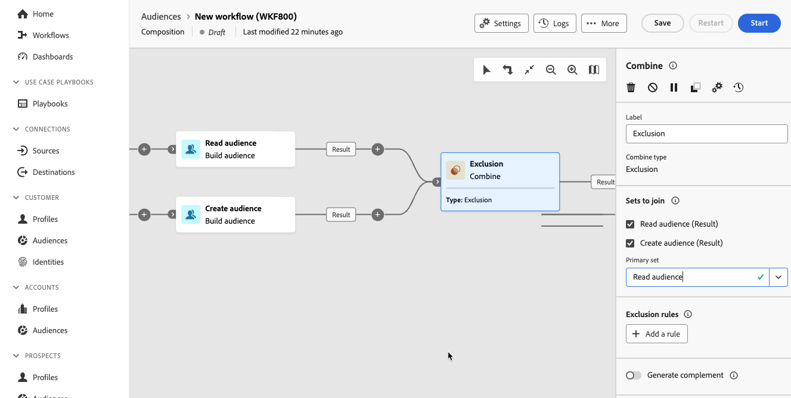

# 合并 {#combine}

>[!CONTEXTUALHELP]
>id="dc_orchestration_combine"
>title="”合并“活动"
>abstract="通过&#x200B;**合并**&#x200B;活动，可对集客群体执行分段。因此，您可以合并多个群体、排除其中的一部分或者仅保留多个目标共有的数据。"

通过&#x200B;**合并**&#x200B;活动，可对集客群体执行分段。因此，您可以合并多个群体，排除部分群体或仅保留多个目标的共有数据。

**组合**&#x200B;活动可以放在任何其他活动之后，但不能放在组合的开头。 任何活动都可以放在&#x200B;**合并**&#x200B;之后。

## 配置“合并”活动 {#combine-configuration}

>[!CONTEXTUALHELP]
>id="dc_orchestration_intersection_merging_options"
>title="交叉合并选项"
>abstract="**交叉**&#x200B;可仅在活动中保留不同入站群体的共有元素。在&#x200B;**要加入的集合**&#x200B;部分中，选中您之前想要加入的所有活动。"

>[!CONTEXTUALHELP]
>id="dc_orchestration_exclusion_merging_options"
>title="排除合并选项"
>abstract="**排除**&#x200B;可根据特定条件从一个群体中排除某些元素。在&#x200B;**要加入的集合**&#x200B;部分中，选中您之前想要加入的所有活动。"

>[!CONTEXTUALHELP]
>id="dc_orchestration_combine_options"
>title="选择分段类型"
>abstract="选择如何合并受众：并集、交叉或排除。"

请按照以下常见步骤操作，开始配置&#x200B;**合并**&#x200B;活动：

1. 添加多个活动以形成至少两个不同的执行分支。

1. 向先前的任何分支添加一个&#x200B;**合并**&#x200B;活动。

1. 选择分段类型： [Union](#union)、[Intersection](#intersection)或[Exclusion](#exclusion)，然后单击&#x200B;**继续**。

   

1. 在&#x200B;**设置为加入**&#x200B;分区中，检查所有先前要加入的活动。

## 并集 {#combine-union}

>[!CONTEXTUALHELP]
>id="dc_orchestration_intersection_reconciliation_options"
>title="交叉协调选项"
>abstract="选择协调类型以定义如何处理重复项。"

>[!CONTEXTUALHELP]
>id="dc_orchestration_combine_reconciliation"
>title="“协调”选项"
>abstract="选择&#x200B;**协调**&#x200B;类型以定义如何处理重复项。"

在&#x200B;**合并**&#x200B;活动中，您可以配置&#x200B;**合并**。

为此，您需要选择&#x200B;**协调类型**&#x200B;以定义如何处理重复项：

* **仅键值**：这是默认模式。当来自不同集客过渡的元素具有相同的键值时，该活动只保留一个元素。仅当集客群体具有同样的性质时，才能使用此选项。
* **选择的列**：选择此选项可定义应用数据协调的列的列表。 必须先选择主集（包含源数据的集），然后选择用于连接的列。

## 交集 {#combine-intersection}

在&#x200B;**合并**&#x200B;活动中，您可以配置&#x200B;**交叉点**。

为此，请执行以下额外步骤：

1. 选择&#x200B;**协调类型**&#x200B;以定义如何处理重复项。请参阅[并集](#union)部分。
1. 如果要处理剩余群体，可以选中&#x200B;**生成补码**&#x200B;选项。 补集将包含所有集客活动减去交集的结果的并集。然后，一个额外的叫客过渡将添加到活动中。

## 差集 {#combine-exclusion}

>[!CONTEXTUALHELP]
>id="dc_orchestration_exclusion_options"
>title="差集规则"
>abstract="必要时，您可以操作集客表。事实上，要从另一个架构（也称为目标选择维度）排除一个目标，必须将该目标返回到与主目标相同的架构。为此，请单击&#x200B;**排除规则**&#x200B;部分中的&#x200B;**添加规则**，并指定架构更改条件。数据协调是通过属性或联接来执行的。"

>[!CONTEXTUALHELP]
>id="dc_orchestration_combine_sets"
>title="选择要合并的集合"
>abstract="在&#x200B;**要加入的集合**&#x200B;部分中，从集客过渡中选择&#x200B;**主要设置**。这是排除了元素的集合。其他集合用于匹配从主要设置中排除之前的元素。"

>[!CONTEXTUALHELP]
>id="dc_orchestration_combine_exclusion"
>title="差集规则"
>abstract="必要时，您可以操作集客表。事实上，要从另一个架构（也称为目标选择维度）排除一个目标，必须将该目标返回到与主目标相同的架构。为此，请单击&#x200B;**排除规则**&#x200B;部分中的&#x200B;**添加规则**，并指定架构更改条件。数据协调是通过属性或联接来执行的。"

>[!CONTEXTUALHELP]
>id="dc_orchestration_combine_complement"
>title="合并生成补集"
>abstract="开启&#x200B;**生成补集**&#x200B;选项以在额外的过渡中处理剩余群体。"

在&#x200B;**合并**&#x200B;活动中，您可以配置&#x200B;**排除项**。

为此，您需要执行以下额外步骤：

1. 在&#x200B;**要加入的集合**&#x200B;部分中，从集客过渡中选择&#x200B;**主要设置**。这是排除了元素的集合。其他集合用于匹配从主要设置中排除之前的元素。

1. 必要时，您可以操作集客表。事实上，要从其他模式中排除某个目标，必须将该目标返回到与主目标相同的模式。 为此，请单击&#x200B;**排除规则**&#x200B;部分中的&#x200B;**添加规则**，并指定架构更改条件。通过属性或连接执行数据协调。<!-- pas compris-->
1. 如果您想处理剩余的人群，可以选中&#x200B;**生成补集**&#x200B;选项。请参阅[交集](#intersection)部分。

<!--
## Examples{#combine-examples}

In the following example, we are using a **Combine** activity and we add a **union** to retrieves all the profiles of the two queries: persons between 18 and 27 years old and persons between 34 and 40 years old.

The following example shows the **intersection** between two query activities. It is being used here to retrieve profiles who are between 18 to 27 years old and whose email address has been provided.

The following **exclusion** example shows two queries configured to filter profiles who are between 18 and 27 years old and have an Adobe email domain. The profiles with an Adobe email domain are then excluded from the first set. 

-->
