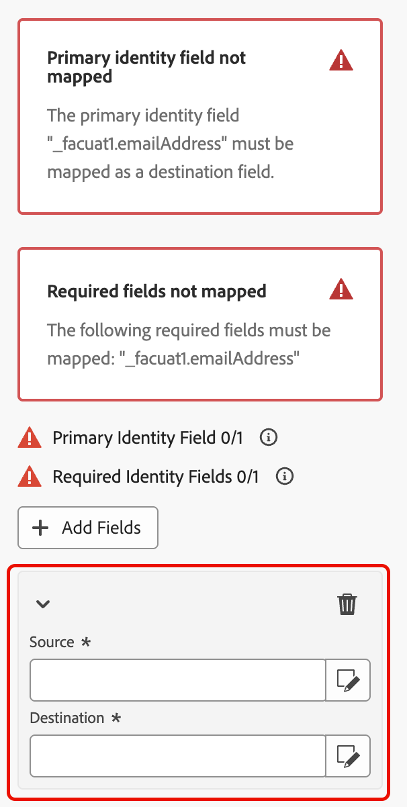

# 保存轮廓 {#save-profile}

>[!CONTEXTUALHELP]
>id="dc_orchestration_saveprofile"
>title="保存轮廓"
>abstract="利用“保存轮廓”活动，可通过联合来自外部仓库的数据来扩充 Experience Platform 轮廓，从而可通过附加属性增强客户轮廓。 "

>[!CONTEXTUALHELP]
>id="dc_orchestration_saveprofile_aepschemalist"
>title="选择 Experience Platform 架构"
>abstract="为轮廓选择 Experience Platform 架构。"

>[!CONTEXTUALHELP]
>id="dc_orchestration_saveprofile_primaryidentitynamespace"
>title="选择主要标识字段"
>abstract="选择用于标识数据库中目标轮廓的主要标识。"

>[!CONTEXTUALHELP]
>id="dc_orchestration_saveprofile_selectaepschema"
>title="选择 Experience Platform 架构"
>abstract="为轮廓选择 Experience Platform 架构。"

>[!CONTEXTUALHELP]
>id="dc_orchestration_saveprofile_updatemode"
>title="保存轮廓更新模式"
>abstract="保存轮廓活动可用的更新模式包括完整更新和增量更新。"

>[!CONTEXTUALHELP]
>id="dc_orchestration_saveprofile_updatemode_full"
>title="完整更新"
>abstract="完整更新模式会更新完整的轮廓集以进行扩充。"

>[!CONTEXTUALHELP]
>id="dc_orchestration_saveprofile_updatemode_incremental"
>title="增量更新"
>abstract="增量更新模式会更新自上次扩充运行以来已修改的轮廓。"

>[!CONTEXTUALHELP]
>id="dc_orchestration_saveprofile_primaryidentityfield"
>title="主要身份标识字段"
>abstract="主要身份标识字段指示将轮廓合并在一起以进行扩充时的真实来源。"

>[!CONTEXTUALHELP]
>id="dc_orchestration_saveprofile_requiredfieldscheck"
>title="必填字段推荐准则"
>abstract="必填字段是导出数据时每个轮廓或记录必须填写的属性。如果缺少必填字段，则导出将不完整或无效。"

>[!CONTEXTUALHELP]
>id="dc_orchestration_saveprofile_primaryidentitycheck"
>title="主要身份标识字段推荐准则"
>abstract="每个轮廓或记录的唯一标识符。这确保每条记录都能被清楚地识别和匹配，防止数据重复。"

利用&#x200B;**[!UICONTROL 保存配置文件]**&#x200B;活动，可使用从外部仓库联合的数据扩充Adobe Experience Platform配置文件。

此活动通常用于通过引入其他属性和见解来增强客户配置文件，而无需将数据实际移动或复制到平台中。

## 配置[!UICONTROL 保存配置文件]活动 {#save-profile-configuration}

>[!IMPORTANT]
>
>**保存配置文件**&#x200B;活动需要启用配置文件的架构和数据集。 要了解如何启用您的数据集以启用配置文件，请阅读[数据集用户指南](https://experienceleague.adobe.com/en/docs/experience-platform/catalog/datasets/user-guide#enable-profile){target="_blank"}。
>
>此外，如果所选数据集&#x200B;**未**&#x200B;启用upsert，则来自用户档案的数据将被替换&#x200B;**&#x200B;**。 要了解如何为数据集启用更新插入，请阅读[启用更新插入指南](https://experienceleague.adobe.com/en/docs/experience-platform/catalog/datasets/enable-upsert)。

按照以下步骤配置&#x200B;**[!UICONTROL 保存配置文件]**&#x200B;活动：

1. 将&#x200B;**[!UICONTROL 保存配置文件]**&#x200B;活动添加到合成。

   {width="1500" zoomable="yes"}

1. 指定要创建的配置文件的标签。

   >[!IMPORTANT]
   >
   >受众标签在当前沙盒中必须是唯一的。 标签不能与任何现有受众相同。

1. 选择要使用的Adobe Experience Platform架构。

   {width="1500" zoomable="yes"}

1. 选择要将扩充保存到的数据集。

   {width="300" zoomable="yes"}

1. 选择数据集后，您可以看到将用于标识数据库中的用户档案的主标识字段。

1. 选择&#x200B;**[!UICONTROL 添加字段]**&#x200B;以添加主要和必需的标识字段。

   {width="300" zoomable="yes"}

   您可以为要映射的每个属性指定&#x200B;**Source**&#x200B;字段（外部数据）和&#x200B;**目标**&#x200B;字段（架构字段）。

   {width="300" zoomable="yes"}

1. 您还可以指定扩充的更新模式。

   {width="300" zoomable="yes"}

   | 更新模式 | 描述 |
   | ----------- | ----------- |
   | 完整更新 | 更新了完整的配置文件集以进行扩充。 |
   | 增量更新 | 仅更新自上次扩充运行以来修改过的配置文件以进行扩充。 |

   如果选择[!UICONTROL 增量更新]，则还需要选择上次修改日期以确定发送的数据。

1. 配置完毕后，选择&#x200B;**启动**。
