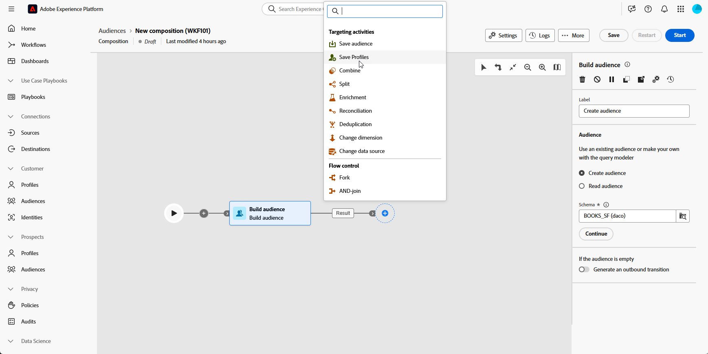
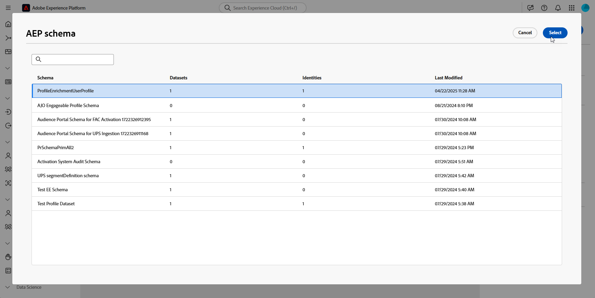

# 保存配置文件 {#save-profile}

>[!CONTEXTUALHELP]
>id="dc_orchestration_saveprofile"
>title="保存个人资料"
>abstract="利用保存用户档案活动，可通过联合来自外部仓库的数据来扩充Experience Platform用户档案，从而可通过附加属性增强客户用户档案。 "

>[!CONTEXTUALHELP]
>id="dc_orchestration_saveprofile_aepschemalist"
>title="选择AEP架构"
>abstract="为配置文件选择Experience Platform架构。"

>[!CONTEXTUALHELP]
>id="dc_orchestration_saveprofile_primaryidentitynamespace"
>title="选择主要标识字段"
>abstract="选择用于标识数据库中目标用户档案的主标识。"

>[!CONTEXTUALHELP]
>id="dc_orchestration_saveprofile_selectaepschema"
>title="选择AEP架构"
>abstract="为配置文件选择Experience Platform架构。"

利用&#x200B;**保存配置文件**&#x200B;活动，可使用从外部仓库联合的数据扩充Adobe Experience Platform配置文件。

此活动通常用于通过引入其他属性和见解来增强客户配置文件，而无需将数据实际移动或复制到平台中

## 配置保存用户档案活动 {#save-profile-configuration}

按照以下步骤配置&#x200B;**保存配置文件**&#x200B;活动：

1. 将&#x200B;**保存配置文件**&#x200B;活动添加到合成。

   

1. 指定要创建的配置文件的标签。

   >[!IMPORTANT]
   >
   >受众标签在当前沙盒中必须是唯一的。 标签不能与任何现有受众相同。

1. 选择要使用的Adobe Experience Platform架构。

   

1. 选择将用于标识数据库中的用户档案的主标识字段。

1. 如果要协调其他数据属性，请单击&#x200B;**添加属性**。

   然后，为要映射的每个属性指定&#x200B;**Source**&#x200B;字段（外部数据）和&#x200B;**目标**&#x200B;字段（架构字段）。

   

1. 配置完毕后，单击&#x200B;**启动**。
