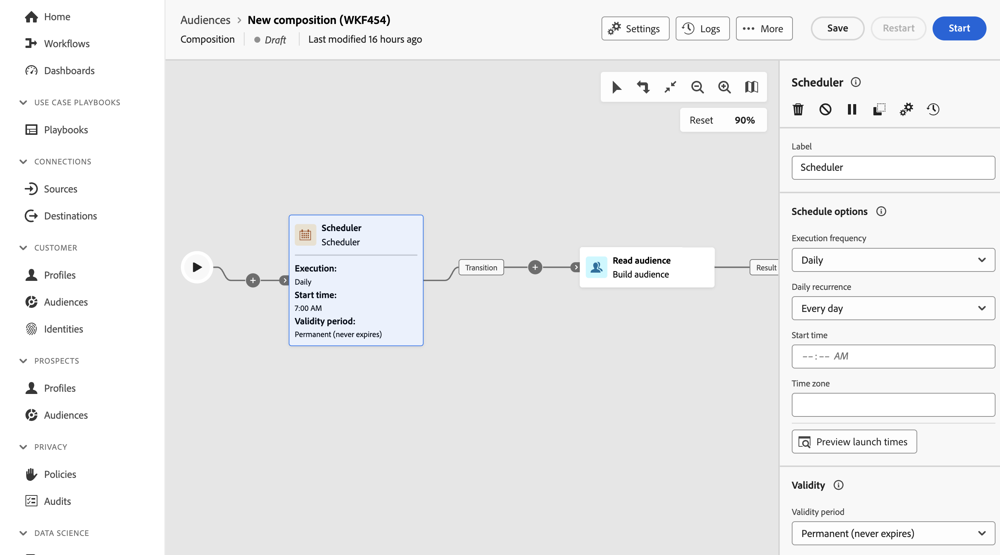

# 调度程序 {#scheduler}

>[!CONTEXTUALHELP]
>id="dc_orchestration_scheduler"
>title="“调度程序”活动"
>abstract="通过&#x200B;**调度程序**&#x200B;活动，可安排何时开始受众构成。应将此活动视为已安排的一次开始。只能将它用作构成的第一个活动。"

**调度程序**&#x200B;活动是&#x200B;**流控制**&#x200B;活动。 它允许您安排何时开始合成。 应将此活动视为已安排的一次开始。它只能用作组成的第一个活动。

如果您已配置与联合受众组合目标的连接，则可以使用此活动定期通过Adobe Experience Platform受众发送。 [了解如何使用外部数据扩充Adobe Experience Platform受众](../../connections/destinations.md)

## 配置调度程序活动 {#scheduler-configuration}

>[!CONTEXTUALHELP]
>id="dc_orchestration_schedule_validity"
>title="调度程序有效期"
>abstract="可定义调度程序的有效期。它可为永久（默认），也可一直有效至特定日期。"

>[!CONTEXTUALHELP]
>id="dc_orchestration_schedule_options"
>title="调度程序选项"
>abstract="定义调度程序的频率。可在特定时刻执行它、每天、每周或每月执行它一次或多次。"

按照以下步骤配置&#x200B;**调度程序**&#x200B;活动：

1. 将&#x200B;**调度程序**&#x200B;活动添加到合成。

1. 配置&#x200B;**执行频率**：

   * **一次**：组合只执行一次。
   * **每日**：组合在特定时间执行，每天执行一次。
   * **一天几次：**&#x200B;组合每天定期执行多次。 您可以设置在特定时间执行或定期执行。

     >[!NOTE]
     >
     >请勿将构成安排为每15分钟运行一次以上，因为它可能会影响整体系统性能，并在数据库中创建块。

   * **每周**：组合在指定的时间执行，每周执行一次或多次。
   * **每月**：组合在指定的时间执行，每月执行一次或多次。 当需要执行合成时，可以选择月份。 您还可以设置在月份的指定周日期（如每月的第二个星期二）执行。

1. 根据所选频率定义执行详情。详情字段可能会因所使用的频率（时间、重复频率、指定天数等）而不同。

1. 单击&#x200B;**预览启动时间**&#x200B;以检查合成接下来十次执行的计划。

1. 定义计划程序的有效期：

   * **永久（永不过期）**：根据指定的频率执行合成，对时间范围或迭代次数没有任何限制。

   * **有效期**：根据指定的频率执行合成，直到达到特定日期为止。 您需要指定开始日期和结束日期。

>[!NOTE]
>
>如果要立即启动合成，可以单击计划程序顶部操作栏中的&#x200B;**执行挂起任务**。 此按钮仅在启动构成时可用。

<!--## Example{#scheduler-example}

In the following example, the activity is configured so that the composition runs several times a day at 9 and 12 AM, every day of the week from October 1st, 2023 to January 1st, 2024.-->
