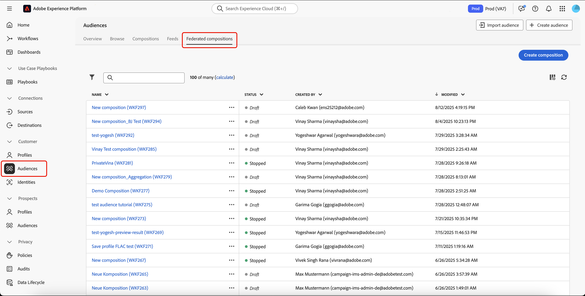
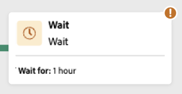

# 创建构成

联合受众构成功能可让您创建构成项目，通过在可视化画布中组合各类活动，以构建受众。在创建构成项目后，生成的受众将被保存至 Adobe Experience Platform，并可用于 Experience Platform 的目标定位功能以及 Adobe Journey Optimizer，实现精准客户投放。

## 定义合成 {#create}

>[!CONTEXTUALHELP]
>id="dc_composition_creation_properties"
>title="构成属性"
>abstract="在此屏幕中，选择要用于创建构成的模板并指定标签。展开“其他选项”部分以配置更多设置，例如构成的内部名称、其文件夹、时区和主管组等。强烈建议选择一个主管组，以便如果出错，可提醒操作员。"

要创建合成，您首先需要定义其标签并（可选）配置其他设置。

要创建合成，请在&#x200B;**[!UICONTROL 客户]**&#x200B;部分中选择&#x200B;**[!UICONTROL 受众]**，然后选择&#x200B;**[!UICONTROL 联合合成]**&#x200B;选项卡。

此时将显示“联合合成”浏览页面。 选择&#x200B;**[!UICONTROL 创建合成]**&#x200B;以继续合成创建过程。

在&#x200B;**[!UICONTROL 属性]**&#x200B;部分中，为合成指定标签并选择数据模型。 只有与此数据模型关联的架构才会在合成的活动中可用。

选择&#x200B;**[!UICONTROL 创建]**。将显示合成画布。 您现在可以通过将活动和过渡添加到画布来配置合成。

## 组合画布 {#canvas}

在画布顶部，您可以访问工具栏，该工具栏提供了用于管理和导航活动的选项。

可用选项包括：

* **[!UICONTROL 多项选择]**：选择多项活动以一次删除所有活动或复制并粘贴活动。
* **[!UICONTROL 旋转]**：将画布切换为垂直显示。
* **[!UICONTROL 适合屏幕]**：根据屏幕调整画布缩放级别。
* **[!UICONTROL 放大]** / **[!UICONTROL 缩小]**：放大或缩小画布。
* **[!UICONTROL 显示映射]**：打开显示您所在位置的画布快照。

## 添加活动 {#add-activities}

在构成画布中，您可以添加有助于定义受众的活动和过渡。 活动允许您&#x200B;*定义*&#x200B;受众中的组件，而过渡允许您&#x200B;*组织*&#x200B;合成流。

有关可用活动和过渡的更多信息，请阅读[活动概述](./activities.md)。

## 管理活动 {#manage-activities}

您可以在属性窗格中对添加的活动执行操作。

这些选项包括：

* **[!UICONTROL 删除]**：从画布中删除该活动。
* **[!UICONTROL 禁用]/[!UICONTROL 启用]**：禁用或启用该活动。 执行合成时，不会在同一路径上执行已禁用的活动和以下活动，并且会停止合成。
* **[!UICONTROL 暂停]/[!UICONTROL 恢复]**：暂停或恢复活动。 执行合成时，它会在暂停的活动中暂停。 相应的任务以及同一路径中后续的所有任务都不会执行。
* **[!UICONTROL 复制]**：复制活动以将其粘贴到合成中的其他位置。 为此，请选择过渡上的&#x200B;**+**&#x200B;按钮，然后选择&#x200B;**[!UICONTROL 粘贴X活动]**。<!-- cannot copy multiple activities ? cannot paste in another composition?-->
* 为所选活动配置&#x200B;**[!UICONTROL 执行选项]**。 可用的执行选项包括：
  +++可用的执行选项

  **[!UICONTROL 属性]**&#x200B;部分允许您配置有关活动执行的常规设置：

   * **[!UICONTROL 执行]**：定义启动时要执行的操作。
   * **[!UICONTROL 最长执行持续时间]**：指定持续时间，如“30s”或“1h”。 如果活动在指定的持续时间过后未完成，则会触发警报。 这不会影响构成的工作方式。
   * **[!UICONTROL 时区]**：选择活动的时区。 联合受众构成允许您在同一实例上管理多个国家/地区之间的时差。 应用的设置将在创建实例时配置。
   * **[!UICONTROL 关联]**：强制合成活动在特定计算机上执行。 要实现此目的，必须为相关活动指定一个或多个任务相关性。
   * **[!UICONTROL 行为]**：定义在使用异步任务时要遵循的过程。

  **[!UICONTROL 错误管理]**&#x200B;部分允许您指定活动遇到错误时要执行的操作。

  **[!UICONTROL 初始化脚本]**&#x200B;部分允许您初始化变量或修改活动属性。 选择&#x200B;**[!UICONTROL 编辑代码]**&#x200B;按钮并键入要执行的代码片段。 活动执行时将调用脚本。

  +++
* **日志和任务**：查看选定活动的日志和任务。

## 启动和监测构成 {#start-and-monitor}

完成将活动添加到合成中后，可以开始执行合成。 要启动合成，请选择屏幕右上角的&#x200B;**[!UICONTROL 开始]**&#x200B;按钮。

| 操作 | 描述 |
| ------ | ----------- |
| **开始** | 开始撰写的执行并将其移动到&#x200B;**正在进行**&#x200B;状态。 |
| **暂停** | 暂停合成的执行并将其设置为&#x200B;**已暂停**&#x200B;状态。 在继续构成之前，不会激活任何新活动，但正在进行的操作&#x200B;**不会**&#x200B;挂起。 |
| **继续** | 继续执行暂停的合成，并将其设置为&#x200B;**正在进行**&#x200B;状态。 |
| **停止** | 停止合成的执行并将其设置为&#x200B;**已完成**&#x200B;状态。 您&#x200B;**无法**&#x200B;从停止的位置恢复合成。 |
| **重新启动** | 停止并重新开始撰写的执行。 |

当合成运行时，按顺序执行画布中的每个活动，直到达到合成结束为止。 您可以使用可视流量实时跟踪目标用户档案的进度。 这允许您快速识别每个活动的状态以及它们之间转换的用户档案数。

每个活动右上角的可视指示器显示执行状态：

| 可视化指示器 | 描述 |
| ---------------- | ------------|
| {zoomable="yes"}{width="70%"} | 当前正在执行活动。 |
| {zoomable="yes"}{width="70%"} | 该活动需要您注意。这可能涉及确认发送投放或执行必要操作。 |
| {zoomable="yes"}{width="70%"} | 活动遇到错误。要解决此问题，请打开组合日志以获取更多信息。 |
| {zoomable="yes"}{width="70%"} | 已成功执行活动。 |

### 监测日志和任务 {#monitor-logs}

此外，您还可以查看构成日志以确保它们正确运行。 在操作工具栏中选择&#x200B;**[!UICONTROL 日志]**&#x200B;以查看此信息。

出现&#x200B;**[!UICONTROL 合成日志和任务]**&#x200B;屏幕。 这将提供合成执行的历史记录，记录所有用户操作和遇到的错误。

历史记录将整理到多个选项卡中，详细信息如下：

* **[!UICONTROL 日志]**&#x200B;选项卡包含所有合成活动的执行历史记录。 它按时间顺序对执行的操作和执行错误进行索引。
* **[!UICONTROL 任务]**&#x200B;选项卡详细列出了活动的执行顺序。 利用每个任务末尾的按钮，可列出通过活动传递的事件变量。
* **[!UICONTROL 变量]**&#x200B;选项卡列出了构成中传递的所有变量。 仅从构成画布访问日志和任务时可用。 现在，当从活动的属性窗格访问日志时，它可用。

在所有选项卡中，您可以选择显示的列及其顺序，应用过滤器，并使用搜索字段快速查找所需信息。

### 订阅警报 {#alerts}

您还可以订阅警报，以便在联合合成执行成功或失败时接收通知。

要订阅警报，请选择，然后选择。

{zoomable="yes"}{width="70%"}

此时会显示通知设置页面。 在此页面上，选择&#x200B;**[!UICONTROL Experience Platform]**，然后选择您想要的警报渠道。 要在UI中查看通知，请选择&#x200B;**[!UICONTROL 应用程序内]**。

{zoomable="yes"}{width="50%"}

选择&#x200B;**[!UICONTROL 应用程序内]**&#x200B;后，您现在将收到有关组合执行成功和失败的通知。

{zoomable="yes"}{width="70%"}

## 配置构成设置。 {#settings}

>[!CONTEXTUALHELP]
>id="dc_composition_settings_properties"
>title="构成属性"
>abstract="此部分提供了通用构成属性，在创建构成时也可以访问这些属性。"

>[!CONTEXTUALHELP]
>id="dc_composition_settings_segmentation"
>title="构成分段"
>abstract="通过默认，仅保留最后一次构成执行的工作表。您可以启用此选项来保留工作表以供测试目的。它必须 **仅** 在开发或暂存环境中使用。绝不能在生产环境中检查它。"

>[!CONTEXTUALHELP]
>id="dc_composition_settings_error"
>title="错误管理设置"
>abstract="在本部分中，您可以定义在执行期间应如何管理错误。您可以选择暂停流程、忽略一定数量的错误或停止构成执行。"

在访问构成时，您可以访问高级设置，例如，这些设置允许您定义构成在出现错误时的行为。

要访问这些附加选项，请在合成创建屏幕的上半部分中选择&#x200B;**[!UICONTROL 设置]**。

| 设置 | 描述 |
| -------- | ----------- |
| **[!UICONTROL 标签]** | 更新为合成指定的名称。 |
| **[!UICONTROL 保留两次执行之间的临时人口结果]** | 如果启用此选项，则即使在执行合成之后，也会保留工作表。 通过默认，仅保留最后一次构成执行的工作表。每天都会删除以前执行中的工作表。 您应该仅在开发或暂存环境中启用此设置。 您应&#x200B;**从不**&#x200B;在生产环境中启用此设置。 |
| **[!UICONTROL 错误管理]** | 定义在构成出错时执行的操作。 有三种可能的选项： <ul><li>**[!UICONTROL 挂起进程]**：构成自动暂停，其状态更改为&#x200B;**[!UICONTROL 失败]**。 问题解决后，使用&#x200B;**[!UICONTROL 恢复]**&#x200B;按钮恢复合成。</li><li>**[!UICONTROL 忽略]**：触发错误的任务状态更改为&#x200B;**[!UICONTROL 失败]**，但构成将保留&#x200B;**[!UICONTROL 已启动]**&#x200B;状态。</li><li>**[!UICONTROL 中止进程]**：组合自动停止，其状态更改为&#x200B;**[!UICONTROL 失败]**。 问题解决后，请使用&#x200B;**[!UICONTROL 开始]**&#x200B;按钮重新启动合成。</li></ul> |
| **[!UICONTROL 个连续错误]** | 指定进程停止前可忽略的错误数。 达到此数字后，撰写状态将更改为&#x200B;**[!UICONTROL 失败]**。 如果此字段的值为0，则无论错误数量如何，合成都不会停止。 |
