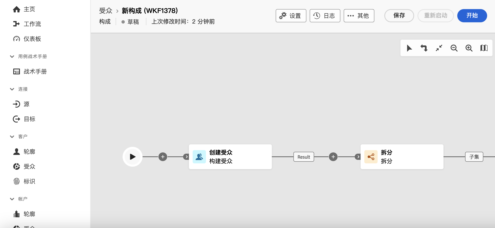
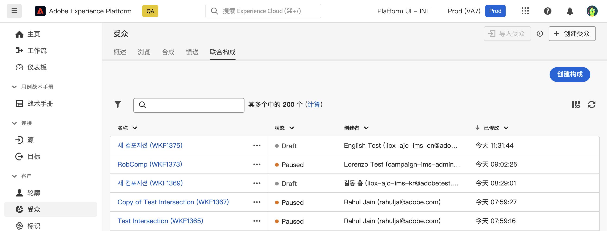
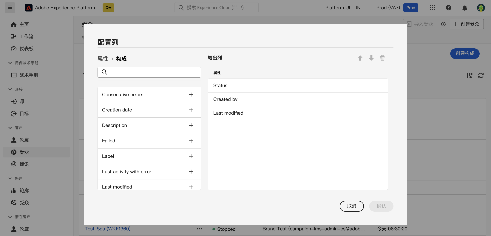

# 合成快速入门 {#compositions}

## 什么是合成？ {#what}

Adobe数据合成允许您创建合成，您可以在其中将各种活动（拆分、排除……）用在可视画布中来创建受众。 完成后，生成的受众将与现有受众一起保存到Adobe Experience Platform中，并可在目标(如Journey Optimizer)中用于定位客户。

## 访问和管理合成 {#access}

>[!CONTEXTUALHELP]
>id="dc_composition_list"
>title="构成"
>abstract="在此屏幕中可访问整个构成列表、检查他们当前的状态、上次/下次执行日期以及创建新构成。"

可从Adobe Experience Platform访问合成 **[!UICONTROL 受众]** 菜单，在 **联合组合** 选项卡。

在此屏幕中，您可以创建新构图并访问现有构图。 您还可以通过单击现有合成名称旁边的省略号按钮来复制或删除现有合成。

要优化列表并轻松查找要查找的合成，您可以搜索列表并按合成的状态或上次处理日期过滤合成。

您还可以通过添加或删除列来自定义列表。 要执行此操作，请单击 **配置列** s按钮并添加或删除所需的输出列。

## 合成状态 {#status}

合成可以具有多种状态：

* **[!UICONTROL 草稿]**：已创建并保存合成。
* **[!UICONTROL 进行中]**：构成已执行，当前正在运行。
* **[!UICONTROL 已停止]**：构成执行已停止。
* **[!UICONTROL 已暂停]**：构成执行已暂停。
* **[!UICONTROL 错误]**：构成执行遇到错误。 打开构成并访问日志和任务以识别错误并解决它。

有关如何启动和监视合成的详细信息，请参阅 [本节](../compositions/start-monitor-composition.md).