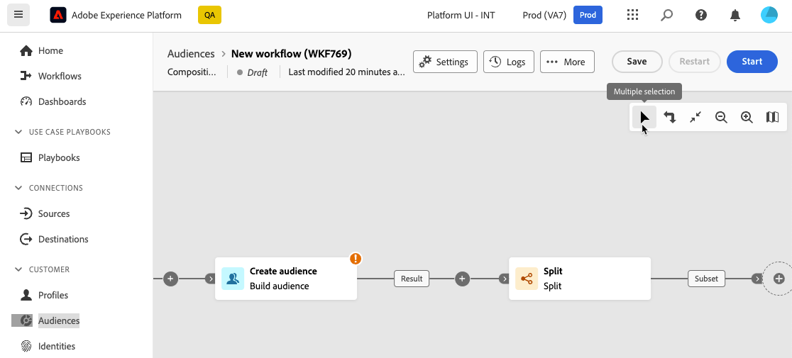

# 编排组合活动 {#activities}

创建构成后，即可开始编排将要执行的不同任务。 为此，提供了一个可视画布，允许您构建受众合成图。 在此图表中，您可以添加各种活动并按顺序连接它们。

## 添加活动 {#add}

在配置的此阶段，将以开始图标显示图表，该图标表示合成的开头。 要添加您的第一个活动，请单击连接到开始图标的&#x200B;**+**&#x200B;按钮。

此时会显示可添加到图中的活动列表。 可用的活动取决于您在构成图中的位置。 例如，添加第一个活动时，您可以通过以下方式启动合成：定位受众、拆分合成路径、设置调度程序以延迟合成执行或设置&#x200B;**等待**&#x200B;活动以延迟合成执行。 另一方面，在&#x200B;**构建受众**&#x200B;活动后，您可以通过定位活动优化目标，或通过流量控制活动组织组合过程。

将活动添加到图后，将显示右侧窗格，允许您使用特定设置配置新添加的活动。 有关如何配置每个活动的详细信息，请参阅[此部分](activities/about-activities.md)。

重复此过程，根据您希望合成执行的任务，添加所需数量的活动。 请注意，您还可以在两个活动之间插入新活动。 为此，请在活动之间的过渡上单击&#x200B;**+**&#x200B;按钮，选择所需的活动并在右侧窗格中对其进行配置。

>[!TIP]
>
>您可以选择为每个活动之间的过渡将名称个性化。 要实现此目的，请选择过渡，然后在右窗格中更改其标签。

## 画布工具栏 {#toolbar}

位于画布右上角的工具栏提供了一些选项，用于轻松处理活动并在画布中导航。

可用的操作包括：

* **[!UICONTROL 多项选择]**：选择多项活动以一次删除所有活动或复制并粘贴活动。 请参阅[此小节](#copy)。
* **[!UICONTROL 旋转]**：垂直切换画布。
* **[!UICONTROL 适合屏幕]**：根据屏幕调整画布缩放级别。
* **[!UICONTROL 缩小]** / **[!UICONTROL 放大]**：缩小或缩小画布。
* **[!UICONTROL 显示映射]**：打开显示您所在位置的画布快照。

## 管理活动 {#manage}

添加活动时，属性窗格中提供了操作按钮，允许您执行多个操作。

您可以：

* 从画布中&#x200B;**[!UICONTROL 删除]**&#x200B;活动。
* **[!UICONTROL 禁用]/[!UICONTROL 启用]**&#x200B;该活动。 执行合成时，不会在同一路径上执行已禁用的活动和以下活动，并且会停止合成。
* **[!UICONTROL 暂停]/[!UICONTROL 继续]**&#x200B;活动。 执行合成时，它会在暂停的活动中暂停。 相应的任务以及在同一路径中跟随该任务的所有任务都不会执行。
* **[!UICONTROL 复制]**&#x200B;该活动以将其粘贴到组合中的其他位置。 为此，请单击过渡上的&#x200B;**+**&#x200B;按钮，然后选择&#x200B;**[!UICONTROL 粘贴X活动]**。<!-- cannot copy multiple activities ? cannot paste in another composition?-->
* 为所选活动配置&#x200B;**[!UICONTROL 执行选项]**。 展开以下部分以了解有关可用选项的更多信息。

  +++可用的执行选项

  **[!UICONTROL 属性]**&#x200B;部分允许您配置有关活动执行的常规设置：

   * **[!UICONTROL 执行]**：定义启动时要执行的操作。
   * **[!UICONTROL 最长执行持续时间]**：指定持续时间，如“30s”或“1h”。 如果活动在指定的持续时间过后未完成，则会触发警报。 这不会影响构成的工作方式。
   * **[!UICONTROL 时区]**：选择活动的时区。 联合受众构成允许您在同一实例上管理多个国家/地区之间的时差。 应用的设置将在创建实例时配置。
   * **[!UICONTROL 关联]**：强制合成活动在特定计算机上执行。 要实现此目的，必须为相关活动指定一个或多个任务相关性。
   * **[!UICONTROL 行为]**：定义在使用异步任务时要遵循的过程。

  **[!UICONTROL 错误管理]**&#x200B;部分允许您指定活动遇到错误时要执行的操作。

  **[!UICONTROL 初始化脚本]**&#x200B;部分允许您初始化变量或修改活动属性。 单击&#x200B;**[!UICONTROL 编辑代码]**&#x200B;按钮并键入要执行的代码片段。 活动执行时将调用脚本。

+++

* 访问活动的&#x200B;**日志和任务**。
