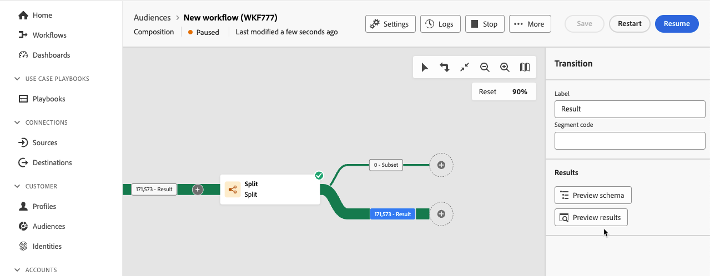

# 启动和监测构成 {#start-monitor}

创建合成并设计要在画布中执行的任务后，即可启动它并监视其执行方式。

## 启动合成 {#start}

要启动合成，请单击屏幕右上角的&#x200B;**[!UICONTROL 开始]**&#x200B;按钮。 当合成运行时，按顺序执行画布中的每个活动，直到达到合成结束为止。

您可以使用可视流量实时跟踪目标用户档案的进度。 这允许您快速识别每个活动的状态以及它们之间转换的用户档案数。

## 合成过渡 {#transitions}

在组合中，通过过渡从一个活动传输到另一个活动的数据存储在临时工作表中。 可以为每个过渡显示此数据。要实现此目的，请选择过渡以在屏幕右侧打开其属性。

* 单击&#x200B;**[!UICONTROL 预览架构]**&#x200B;以显示工作表的架构。
* 单击&#x200B;**[!UICONTROL 预览结果]**&#x200B;以可视化在所选过渡中传输的数据。 仅当启用了&#x200B;**[!UICONTROL 保留两次执行之间的临时群体的结果]**&#x200B;选项时，此选项才可用。 [了解详情](create-composition.md#settings)。

## 监测活动执行 {#activities}

通过每个活动框右上角的视觉指示器，可检查其执行情况：

| 可视化指示器 | 描述 |
|-----|------------|
| {zoomable="yes"}{width="70%"} | 当前正在执行活动。 |
| {zoomable="yes"}{width="70%"} | 该活动需要您注意。这可能涉及确认发送投放或执行必要操作。 |
| {zoomable="yes"}{width="70%"} | 活动遇到错误。要解决此问题，请打开组合日志以获取更多信息。 |
| {zoomable="yes"}{width="70%"} | 已成功执行活动。 |

## 监测日志和任务 {#logs-tasks}

监测合成日志和任务是分析合成并确保它们正常运行的关键步骤。 可从操作工具栏和每个活动的属性窗格中的&#x200B;**[!UICONTROL 日志]**&#x200B;按钮访问它们。

**[!UICONTROL 合成日志和任务]**&#x200B;屏幕提供了合成执行的历史记录，记录了所有用户操作和遇到的错误。

<!-- à confirmer, pas trouvé dans les options = The workflow history is saved for the duration specified in the workflow execution options. During this duration, all the messages are therefore saved, even after a restart. If you do not want to save the messages from a previous execution, you have to purge the history by clicking the  button.-->

历史记录将整理到多个选项卡中，详细信息如下：

* **[!UICONTROL 日志]**&#x200B;选项卡包含所有合成活动的执行历史记录。 它按时间顺序对执行的操作和执行错误进行索引。
* **[!UICONTROL 任务]**&#x200B;选项卡详细列出了活动的执行顺序。 利用每个任务末尾的按钮，可列出通过活动传递的事件变量。
* **[!UICONTROL 变量]**&#x200B;选项卡列出了构成中传递的所有变量。 仅从构成画布访问日志和任务时可用。 现在，当从活动的属性窗格访问日志时，它可用。 <!-- à confirmer-->

在所有选项卡中，您可以选择显示的列及其顺序，应用过滤器，并使用搜索字段快速查找所需信息。

## 订阅警报 {#alerts}

此外，您可以订阅警报，以便在联合合成执行成功或失败时接收通知。

要订阅警报，请选择，然后选择。

{zoomable="yes"}{width="70%"}

此时会显示通知设置页面。 在此页面上，选择&#x200B;**[!UICONTROL Experience Platform]**，然后选择您想要的警报渠道。 要在UI中查看通知，请选择&#x200B;**[!UICONTROL 应用程序内]**。

{zoomable="yes"}{width="50%"}

选择&#x200B;**[!UICONTROL 应用程序内]**&#x200B;后，您现在将收到有关组合执行成功和失败的通知。

{zoomable="yes"}{width="70%"}

## 组合执行命令 {#execution-commands}

右上角的操作栏提供了用于管理合成执行的命令。

可用的操作包括：

* **[!UICONTROL 开始]**：开始执行合成，然后会显示&#x200B;**[!UICONTROL 正在进行]**&#x200B;状态。 开始构成并激活初始活动。

* **[!UICONTROL 恢复]**：恢复执行已暂停的合成。 构成采用&#x200B;**[!UICONTROL 正在进行]**&#x200B;状态。

* **[!UICONTROL 暂停]**&#x200B;合成执行，这会显示&#x200B;**[!UICONTROL 暂停]**&#x200B;状态。 在恢复之前，不会激活任何新活动，但不会暂停正在进行的操作。

* **[!UICONTROL 停止]**&#x200B;正在执行的合成，该合成随后将呈现&#x200B;**[!UICONTROL 已完成]**&#x200B;状态。 如果可能，正在执行的操作会被中断。 您无法从停止的同一位置恢复合成。

* **[!UICONTROL 重新启动]**：停止然后重新启动合成。 在大多数情况下，由于停止操作需要花费一定的时间，因此可让您更快地重新启动，并且&#x200B;**[!UICONTROL 启动]**&#x200B;按钮仅在停止操作生效时才可用。

