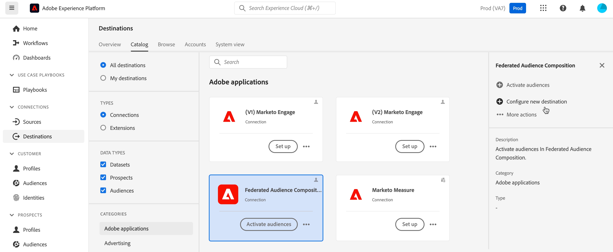
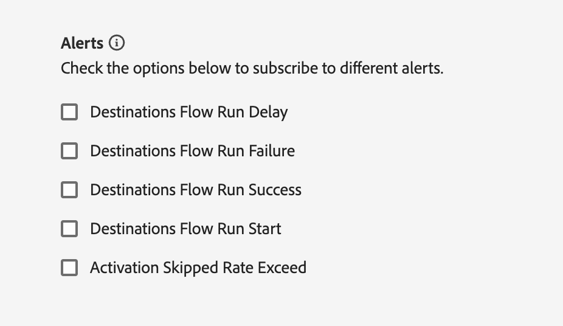

# 利用外部数据丰富 Adobe Experience Platform 受众 {#connect-aep-fac}

>[!CONTEXTUALHELP]
>id="dc_new_destination"
>title="创建目标"
>abstract="输入设置以连接到新的联合数据库。 使用 **[!UICONTROL 连接到目标]** 按钮来验证您的配置。"

Adobe Experience Platform允许使用&#x200B;**Adobe联合受众组合目标**，将受众门户中的受众与外部数据库无缝集成。 通过此集成，您可以将现有受众利用到组合中，并使用外部数据库中的数据扩充或优化这些受众以创建新受众。

为此，您需要在Adobe Experience Platform中设置与Adobe联合受众组合目标的新连接。 您可以使用调度程序以固定频率发送给定受众，并选择要包含的特定属性，例如用于数据协调的ID。 如果您已将治理和隐私政策应用于受众，则更新受众后，这些政策将被保留并发送回受众门户。

例如，假设您要将购买信息存储在数据仓库中，并且最近两个月内有一个Adobe Experience Platform受众定位对特定产品感兴趣的客户。 使用联合受众合成目标，您可以：

* 根据购买信息优化受众。 例如，您可以筛选受众，以定位仅购买超过$150的客户。
* 使用与购买相关的字段（如产品名称和购买数量）扩充受众。

## 将受众激活到目标 {#activate}

在Adobe Experience Platform目标目录中，选择联合受众组合目标。 在右窗格中，选择&#x200B;**[!UICONTROL 配置新目标]**。

此时会显示&#x200B;**[!UICONTROL 配置新目标]**&#x200B;页面。 在此页上，可以配置目标的详细信息，包括名称、说明、连接类型和联合数据库。

在&#x200B;**[!UICONTROL 警报]**&#x200B;部分中，您可以启用警报以接收有关数据流到目标的状态的通知。 其中包括数据流运行延迟、运行失败、运行成功、运行启动和激活跳过等警报。

有关警报的详细信息，请阅读有关Adobe Experience Platform文档[使用UI订阅目标警报](https://experienceleague.adobe.com/zh-hans/docs/experience-platform/destinations/ui/alerts){target="_blank"}。

完成目标的详细信息配置后，请选择&#x200B;**[!UICONTROL 下一步]**。 出现&#x200B;**[!UICONTROL 治理策略和实施操作]**&#x200B;步骤。 在此页面上，您可以定义数据管理策略，并确保在发送和激活受众时使用的数据符合要求。

完成选择目标所需的营销操作后，选择&#x200B;**[!UICONTROL 创建]**。

将创建到目标的新连接。 您现在可以激活受众以发送到目标。 选择要激活受众的目标，然后选择&#x200B;**[!UICONTROL 下一步]**。

显示&#x200B;**[!UICONTROL 计划]**&#x200B;步骤。 您可以选择要激活到目标的所需受众。 要设置计划，请选择以编辑您的导出计划。

出现&#x200B;**[!UICONTROL 计划]**&#x200B;弹出框。 在此弹出窗口中，您可以定义文件导出选项、频率并设置计划。

>[!NOTE]
>
>要更快地激活受众，请选择&#x200B;**[!UICONTROL 区段评估后]**&#x200B;选项，以便在每日平台批量分段作业完成后立即触发激活作业。
>
>有关如何配置计划和文件名的详细信息，请参阅Adobe Experience Platform文档的以下部分：
>
>* [计划受众导出](https://experienceleague.adobe.com/zh-hans/docs/experience-platform/destinations/ui/activate/activate-batch-profile-destinations#scheduling){target="_blank"}
>* [配置文件名](https://experienceleague.adobe.com/zh-hans/docs/experience-platform/destinations/ui/activate/activate-batch-profile-destinations#configure-file-names){target="_blank"}

在&#x200B;**[!UICONTROL 映射]**&#x200B;步骤中，选择要为受众导出的属性和标识字段。

>[!IMPORTANT]
>
>激活目标时，您&#x200B;**无法**&#x200B;使用系统生成的列。 选择系统生成的列将导致激活失败。

有关详细信息，请参阅Adobe Experience Platform文档中的[映射部分](https://experienceleague.adobe.com/zh-hans/docs/experience-platform/destinations/ui/activate/activate-batch-profile-destinations#mapping){target="_blank"}。

查看目标配置和受众设置，然后选择&#x200B;**[!UICONTROL 完成]**。

现在将为新连接激活选定的受众。 您可以通过导航回&#x200B;**[!UICONTROL 激活受众]**&#x200B;页面，添加更多要通过此连接发送的受众。 激活受众后，您无法删除这些受众。
