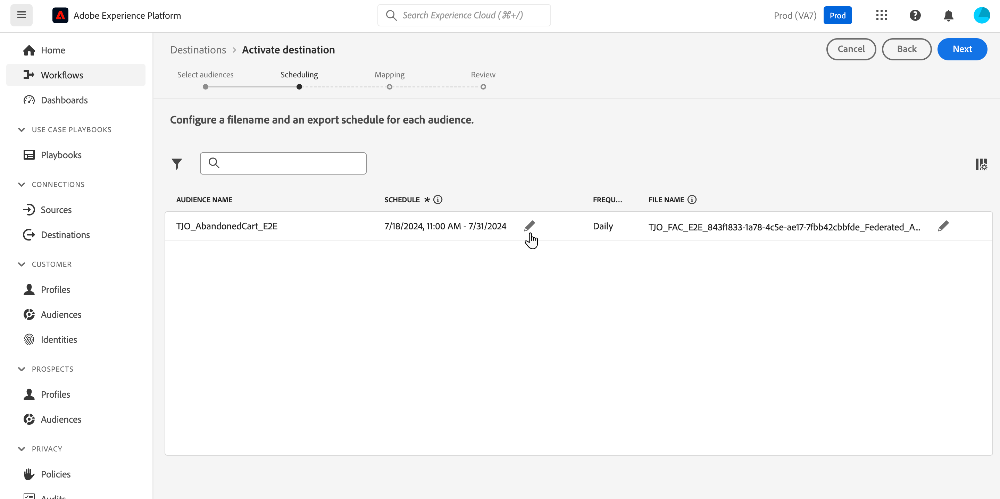

# 将Adobe Experience Platform发送到Adobe联合受众构成 {#connect-aep-fac}

>[!CONTEXTUALHELP]
>id="dc_new_destination"
>title="创建目标"
>abstract="输入设置以连接到新的联合数据库。使用 **[!UICONTROL 连接到目标]** 按钮来验证您的配置。"

利用Adobe Experience Platform，可将受众从受众门户发送到Adobe联合受众合成。 这样，您就可以将现有受众利用到组合中，并将其与外部数据库中的数据相结合，从而创建新受众或更新现有受众。

为此，您需要在Adobe Experience Platform中设置与Adobe联合受众组合目标的新连接。 您可以使用调度程序以固定频率发送给定受众，选择要与受众一起发送的字段，如要协调数据的ID。 如果您已将治理和隐私政策应用于受众，则更新受众后，这些政策将被保留并发送回受众门户。

将Adobe Experience Platform受众发送到Adobe联合受众组合的主要步骤如下：

1. 访问Adobe Experience Platform目标目录并选择联合受众组合目标。

   在右窗格中，选择&#x200B;**[!UICONTROL 配置新目标]**。

   

1. 为新连接提供一个名称，并选择要使用的&#x200B;**[!UICONTROL 连接类型]**&#x200B;和要连接的&#x200B;**[!UICONTROL 联合数据库]**，然后单击&#x200B;**[!UICONTROL 下一步]**。

   

   **[!UICONTROL 警报]**&#x200B;部分允许您启用警报，以接收有关流向目标的数据流状态的通知。 有关警报的详细信息，请参阅[使用UI订阅目标警报的指南](../../ui/alerts.md)。

1. 在&#x200B;**[!UICONTROL 治理策略和实施操作]**&#x200B;步骤中，您可以定义数据治理策略，并确保在发送和激活受众时使用的数据是合规的。

   完成选择目标所需的营销操作后，单击&#x200B;**[!UICONTROL 创建]**。

1. 将创建到目标的新连接。 您现在可以激活受众以发送到目标。 若要执行此操作，请从列表中选择它，然后单击&#x200B;**[!UICONTROL 下一步]**

   

1. 选择要发送的所需受众，然后单击&#x200B;**[!UICONTROL 下一步]**。

1. 为所选受众配置文件名和导出计划。

   

   >[!NOTE]
   >
   >有关如何配置计划和文件名的详细信息，请参阅Adobe Experience Platform文档：
   >* [计划受众导出](https://experienceleague.adobe.com/en/docs/experience-platform/destinations/ui/activate/activate-batch-profile-destinations#scheduling)
   >* [配置文件名](https://experienceleague.adobe.com/en/docs/experience-platform/destinations/ui/activate/activate-batch-profile-destinations#configure-file-names)

1. 在&#x200B;**[!UICONTROL 映射]**&#x200B;步骤中，选择要为受众导出的属性和标识字段。 有关详细信息，请参阅Adobe Experience Platform文档中的[映射步骤](https://experienceleague.adobe.com/en/docs/experience-platform/destinations/ui/activate/activate-batch-profile-destinations#mapping)。

   

1. 查看目标配置和受众设置，然后单击&#x200B;**[!UICONTROL 完成]**。

   

现在将为新连接激活选定的受众。 您可以通过导航回&#x200B;**[!UICONTROL 激活受众]**&#x200B;页面，添加更多要通过此连接发送的受众。 激活受众后，您无法删除这些受众。
