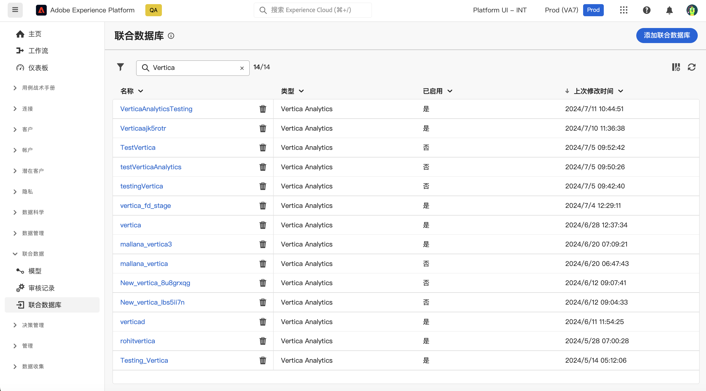
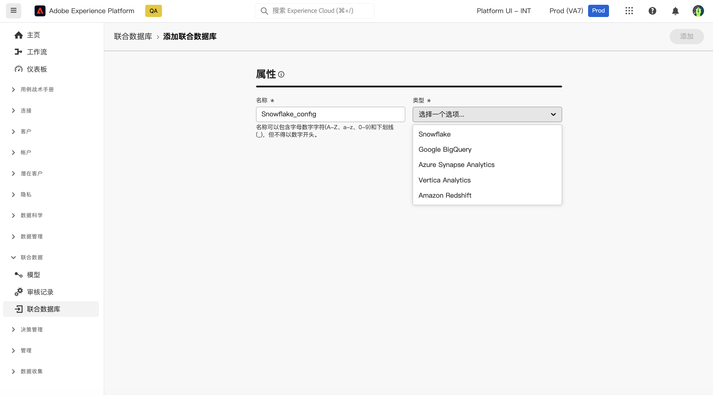
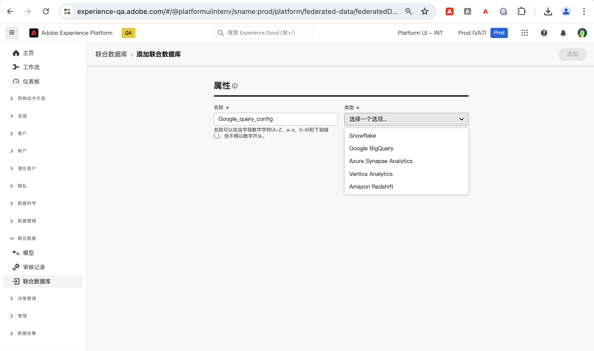
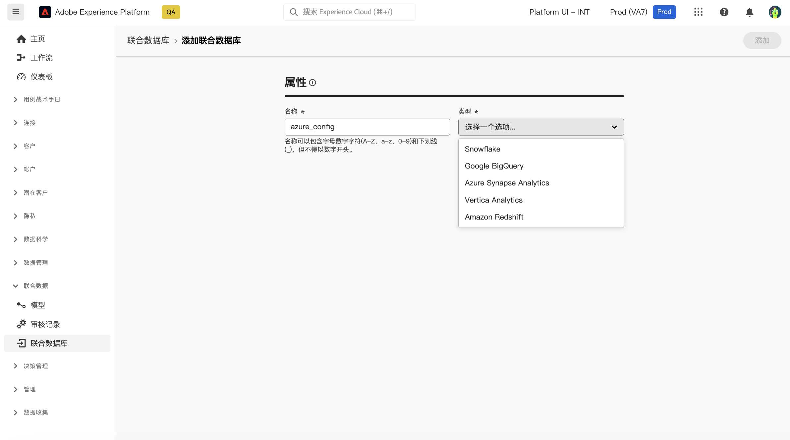
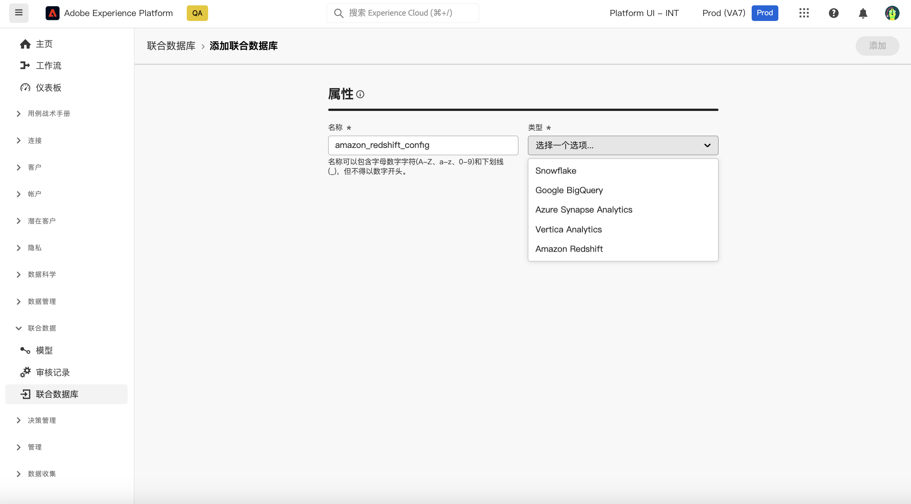

# 开始使用联合数据库 {#federated-db}

>[!CONTEXTUALHELP]
>id="dc_connection_federated_database_menu"
>title="联合数据库"
>abstract="此屏幕列出了与联合数据库的现有连接。要创建新连接，请点击 **[!UICONTROL 添加联合数据库]** 按钮。"

>[!CONTEXTUALHELP]
>id="dc_connection_federated_database_properties"
>title="联合数据库属性"
>abstract="输入新的联合数据库的名称，并选择其类型。"

>[!CONTEXTUALHELP]
>id="dc_connection_federated_database_details"
>title="联合数据库详细信息"
>abstract="输入设置以连接到新的联合数据库。使用 **[!UICONTROL 测试连接]** 按钮验证您的配置。"

联合受众构成允许客户从第三方数据仓库构建和丰富受众，并将受众导入到Adobe Experience Platform。

在此页面中了解如何创建、配置、测试和保存与外部数据库的连接。

## 支持的数据库 {#supported-db}

使用联合受众合成，您可以连接到以下数据库：

* Amazon Redshift
* azure synapse
* Google Big Query
* Snowflake
* Vertica Analytics

## Snowflake {#snowflake}

使用联合数据库处理存储在外部数据库中的信息。 按照以下步骤配置对Snowflake的访问权限。

1. 在&#x200B;**[!UICONTROL 联合数据]**&#x200B;菜单下，选择&#x200B;**[!UICONTROL 联合数据库]**。

1. 单击&#x200B;**[!UICONTROL 添加联合数据库]**。

   

1. 输入联合数据库的&#x200B;**[!UICONTROL 名称]**。

1. 从&#x200B;**[!UICONTROL 类型]**&#x200B;下拉列表中，选择Snowflake。

   

1. 配置Snowflake身份验证设置：

   * **[!UICONTROL 服务器]**：输入您的服务器名称。

   * **[!UICONTROL 用户]**：输入用户名。

   * **[!UICONTROL 密码]**：输入帐户密码。

   * **[!UICONTROL 数据库]**（可选）：如果未在DSN中指定，请输入数据库的名称。

   * **[!UICONTROL 工作架构]**（可选）：输入工作架构的名称。

   * **[!UICONTROL 私钥]**：单击&#x200B;**[!UICONTROL 私钥]**&#x200B;字段，从区域设置文件夹中选择.pem文件。

   * **[!UICONTROL 选项]**：连接器支持下表中详述的选项。

1. 选择&#x200B;**[!UICONTROL 测试连接]**&#x200B;选项以验证您的配置。

1. 单击&#x200B;**[!UICONTROL 部署函数]**&#x200B;按钮以创建函数。

1. 完成配置后，单击&#x200B;**[!UICONTROL 添加]**&#x200B;以创建联合数据库。

连接器支持以下选项：

| 选项 | 描述 |
|---|---|
| 工作模式 | 用于工作表的数据库模式 |
| 仓库 | 要使用的默认仓库的名称。 它将覆盖用户的默认值。 |
| 时区名称 | 默认情况下为空，这意味着使用Campaign Classic应用程序服务器的系统时区。 选项可用于强制使用时区会话参数。  有关详情，请参阅[本页](https://docs.snowflake.net/manuals/sql-reference/parameters.html#timezone)。 |
| weekstart | WEEK_START会话参数。 默认设置为0。  有关详情，请参阅[本页](https://docs.snowflake.com/en/sql-reference/parameters.html#week-start)。 |
| UseCachedResult | USE_CACHED_RESULTS会话参数。 默认设置为TRUE。 此选项可用于禁用Snowflake缓存的结果。  有关详情，请参阅[本页](https://docs.snowflake.net/manuals/user-guide/querying-persisted-results.html)。 |
| bulkthreads | 用于Snowflake批量加载器的线程数，线程越多，批量加载越大，性能越好。 默认设置为1。 根据计算机线程数，可以调整该数字。 |
| chunkSize | 确定批量加载程序块的文件大小。 默认设置为128MB。 当与bulkThreads一起使用时，可以修改以获得更佳的性能。 更多并发活动线程意味着更好的性能。  有关详细信息，请参阅[Snowflake文档](https://docs.snowflake.net/manuals/sql-reference/sql/put.html)。 |
| 阶段名称 | 预配置的内部阶段的名称。 它将用于批量加载，而不是创建新的临时阶段。 |

## Google Big Query {#google-big-query}

使用联合数据库处理存储在外部数据库中的信息。 请按照以下步骤配置对Google Big Query的访问权限。

1. 在&#x200B;**[!UICONTROL 联合数据]**&#x200B;菜单下，选择&#x200B;**[!UICONTROL 联合数据库]**。

1. 单击&#x200B;**[!UICONTROL 添加联合数据库]**。

   

1. 输入联合数据库的&#x200B;**[!UICONTROL 名称]**。

1. 从&#x200B;**[!UICONTROL 类型]**&#x200B;下拉列表中，选择Google Big Query。

   

1. 配置Google Big Query身份验证设置：

   * **[!UICONTROL 服务帐户]**：输入&#x200B;**[!UICONTROL 服务帐户]**&#x200B;的电子邮件。 有关详细信息，请参阅[Google Cloud文档](https://cloud.google.com/iam/docs/creating-managing-service-accounts)。

   * **[!UICONTROL 项目]**：输入&#x200B;**[!UICONTROL 项目]**&#x200B;的名称。 有关详细信息，请参阅[Google Cloud文档](https://cloud.google.com/resource-manager/docs/creating-managing-projects)。

   * **[!UICONTROL 数据集]**：输入&#x200B;**[!UICONTROL 数据集]**&#x200B;的名称。 有关详细信息，请参阅[Google Cloud文档](https://cloud.google.com/bigquery/docs/datasets-intro)。

   * **[!UICONTROL 密钥文件路径]**：将您的密钥文件上载到服务器。 仅接受.json文件。

   * **[!UICONTROL 选项]**：连接器支持下表中详述的选项。

1. 选择&#x200B;**[!UICONTROL 测试连接]**&#x200B;选项以验证您的配置。

1. 单击&#x200B;**[!UICONTROL 部署函数]**&#x200B;按钮以创建函数。

1. 完成配置后，单击&#x200B;**[!UICONTROL 添加]**&#x200B;以创建联合数据库。

| 选项 | 描述 |
|:-:|:-:|
| 代理类型 | 用于通过ODBC和SDK连接器连接到BigQuery的代理类型。 当前支持 HTTP（默认）、http_no_tunnel、socks4和socks5。 |
| 代理主机 | 可访问代理的主机名或IP地址。 |
| 代理端口 | 代理正在运行的端口号，如8080 |
| ProxyUid | 用于经过身份验证的代理的用户名 |
| ProxyPdw | ProxyUid密码 |
| bqpath | 请注意，这仅适用于批量加载工具(Cloud SDK)。  为避免使用PATH变量或必须将google-cloud-sdk目录移动到其他位置，您可以使用此选项指定服务器上云sdk bin目录的精确路径。 |
| GCloudConfigName | 请注意，这从7.3.4版本开始适用，并且仅适用于批量加载工具(Cloud SDK)。  Google Cloud SDK使用配置将数据加载到BigQuery表中。 名为`accfda`的配置存储用于加载数据的参数。 但是，此选项允许用户为配置指定不同的名称。 |
| GCloudDefaultConfigName | 请注意，这从7.3.4版本开始适用，并且仅适用于批量加载工具(Cloud SDK)。 必须先将活动标记转移到新配置，然后才能删除活动的Google Cloud SDK配置。 此临时配置是重新创建用于加载数据的主配置所必需的。 临时配置的默认名称为`default`，如果需要，可以更改此名称。 |
| GCloudRecreateConfig | 请注意，这从7.3.4版本开始适用，并且仅适用于批量加载工具(Cloud SDK)。 设置为`false`时，批量加载机制不会尝试重新创建、删除或修改Google Cloud SDK配置。 相反，它会使用计算机上的现有配置继续加载数据。 当其他操作依赖于Google Cloud SDK配置时，此功能很有价值。  如果用户在没有适当配置的情况下启用此引擎选项，则批量加载机制将发出警告消息： `No active configuration found. Please either create it manually or remove the GCloudRecreateConfig option`。 为了防止进一步的错误，它随后将恢复为使用默认的ODBC数组插入批量加载机制。 |

## azure synapseRedshift {#azure-synapse-redshift}

使用联合数据库处理存储在外部数据库中的信息。 按照以下步骤配置对Azure synapseRedshift的访问权限。

1. 在&#x200B;**[!UICONTROL 联合数据]**&#x200B;菜单下，选择&#x200B;**[!UICONTROL 联合数据库]**。

1. 单击&#x200B;**[!UICONTROL 添加联合数据库]**。

   

1. 输入联合数据库的&#x200B;**[!UICONTROL 名称]**。

1. 从&#x200B;**[!UICONTROL 类型]**&#x200B;下拉列表中，选择Azure synapseRedshift。

   

1. 配置Azure synapseRedshift身份验证设置：

   * **[!UICONTROL 服务器]**：输入Azure synapse服务器的URL。

   * **[!UICONTROL 帐户]**：输入用户名。

   * **[!UICONTROL 密码]**：输入帐户密码。

   * **[!UICONTROL 数据库]**（可选）：如果未在DSN中指定，请输入数据库的名称。

   * **[!UICONTROL 选项]**：连接器支持下表中详述的选项。

1. 选择&#x200B;**[!UICONTROL 测试连接]**&#x200B;选项以验证您的配置。

1. 单击&#x200B;**[!UICONTROL 部署函数]**&#x200B;按钮以创建函数。

1. 完成配置后，单击&#x200B;**[!UICONTROL 添加]**&#x200B;以创建联合数据库。

| 选项 | 描述 |
|:-:|:-:|
| 身份验证 | 连接器支持的身份验证类型。 当前支持的值： ActiveDirectoryMSI。 有关详细信息，请参阅[SQL文档](https://learn.microsoft.com/en-us/sql/connect/odbc/using-azure-active-directory?view=sql-server-ver15#example-connection-strings)（连接字符串n°8示例） |

## Vertica Analytics {#vertica-analytics}

使用联合数据库处理存储在外部数据库中的信息。 请按照以下步骤配置对Vertica analytics的访问权限。

1. 在&#x200B;**[!UICONTROL 联合数据]**&#x200B;菜单下，选择&#x200B;**[!UICONTROL 联合数据库]**。

1. 单击&#x200B;**[!UICONTROL 添加联合数据库]**。

   

1. 输入联合数据库的&#x200B;**[!UICONTROL 名称]**。

1. 从&#x200B;**[!UICONTROL 类型]**&#x200B;下拉列表中，选择Vertica analytics。

   

1. 配置Vertica analytics身份验证设置：

   * **[!UICONTROL 服务器]**：添加[!DNL Vertica Analytics]服务器的URL。

   * **[!UICONTROL 帐户]**：添加用户名。

   * **[!UICONTROL 密码]**：添加帐户密码。

   * **[!UICONTROL 数据库]**（可选）：如果未在DSN中指定，请输入数据库的名称。

   * **[!UICONTROL 工作架构]**（可选）：输入工作架构的名称。

   * **[!UICONTROL 选项]**：连接器支持下表中详述的选项。

1. 选择&#x200B;**[!UICONTROL 测试连接]**&#x200B;选项以验证您的配置。

1. 单击&#x200B;**[!UICONTROL 部署函数]**&#x200B;按钮以创建函数。

1. 完成配置后，单击&#x200B;**[!UICONTROL 添加]**&#x200B;以创建联合数据库。

连接器支持以下选项：

| 选项 | 描述 |
|---|---|
| 时区名称 | 默认情况下为空，这意味着使用Campaign Classic应用程序服务器的系统时区。 选项可用于强制使用时区会话参数。 |

## Amazon Redshift {#amazon-redshift}

使用联合数据库处理存储在外部数据库中的信息。 执行以下步骤以配置对Amazon Redshift的访问权限。

1. 在&#x200B;**[!UICONTROL 联合数据]**&#x200B;菜单下，选择&#x200B;**[!UICONTROL 联合数据库]**。

1. 单击&#x200B;**[!UICONTROL 添加联合数据库]**。

   

1. 输入联合数据库的&#x200B;**[!UICONTROL 名称]**。

1. 从&#x200B;**[!UICONTROL 类型]**&#x200B;下拉列表中，选择Amazon Redshift。

   

1. 配置Amazon Redshift身份验证设置：

   * **[!UICONTROL 服务器]**：添加DNS的名称。

   * **[!UICONTROL 帐户]**：添加用户名。

   * **[!UICONTROL 密码]**：添加帐户密码。

   * **[!UICONTROL 数据库]**：如果未在DSN中指定数据库的名称。 如果在DSN中指定，它可以留空

   * **[!UICONTROL 工作架构]**：工作架构的名称。 [了解详情](https://docs.aws.amazon.com/redshift/latest/dg/r_Schemas_and_tables.html)

1. 选择&#x200B;**[!UICONTROL 测试连接]**&#x200B;选项以验证您的配置。

1. 单击&#x200B;**[!UICONTROL 部署函数]**&#x200B;按钮以创建函数。

1. 完成配置后，单击&#x200B;**[!UICONTROL 添加]**&#x200B;以创建联合数据库。