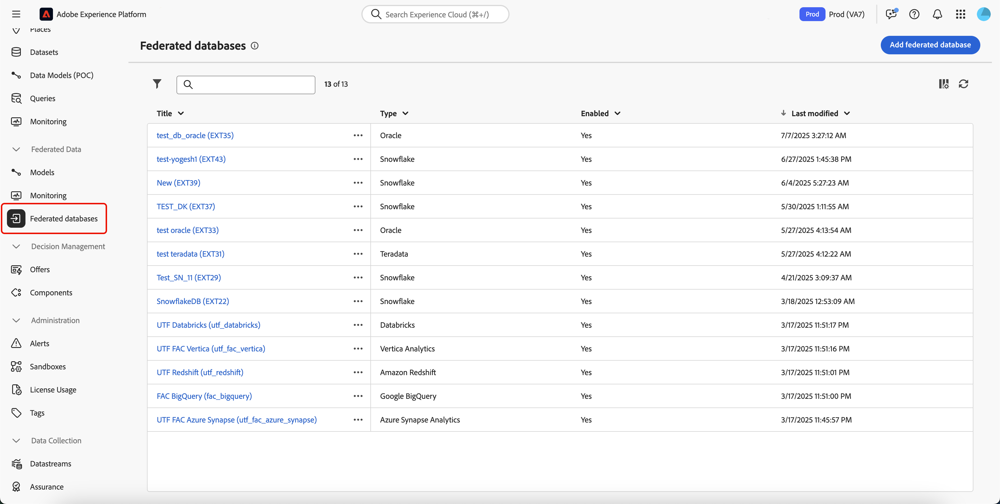
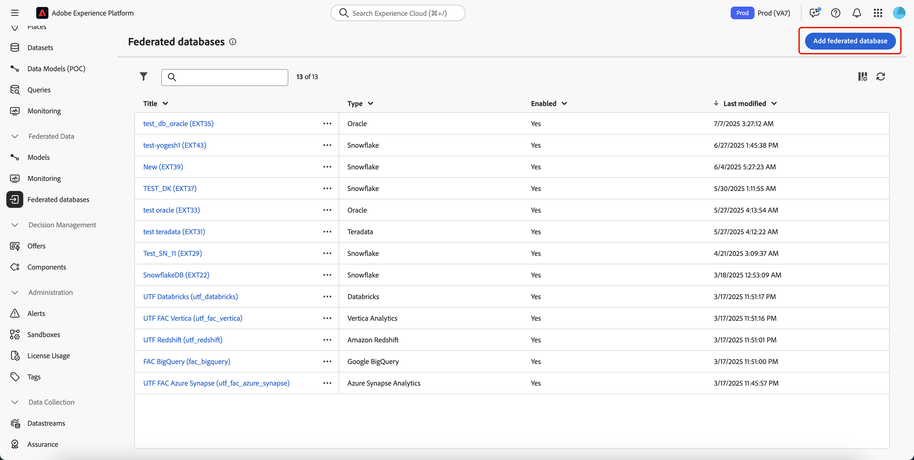
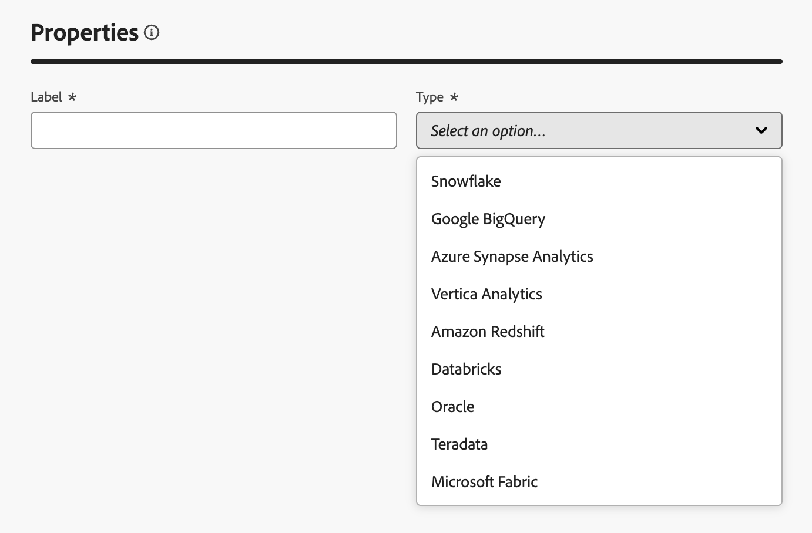

# 创建连接 {#connections-fdb}

>[!AVAILABILITY]
>
>要访问连接，您需要以下权限之一：
>
>-**管理联合数据库**
>-**查看联合数据库**
>
>有关所需权限的更多信息，请阅读[访问控制指南](/help/governance-privacy-security/access-control.md)。

Experience Platform联合受众构成允许您从第三方数据仓库构建和丰富受众，并将受众导入到Adobe Experience Platform。

## 支持的数据库 {#supported-databases}

要使用联合数据库和Adobe Experience Platform，必须首先在这两个源之间建立连接。 使用联合受众合成，您可以连接到以下数据库。

- Amazon Redshift
- Azure Synapse Analytics
- 数据块
- Google BigQuery
- Microsoft Fabric
- Oracle
- Snowflake
- Teradata
- Vertica Analytics

## 创建连接 {#create}

要创建连接，请在联合数据部分中选择&#x200B;**[!UICONTROL 联合数据库]**。

{zoomable="yes" width="70%" align="center"}

此时将显示“联合数据库”部分。 选择&#x200B;**[!UICONTROL 添加联合数据库]**&#x200B;以创建连接。

{zoomable="yes" width="70%" align="center"}

>[!NOTE]
>
>要使用专用链接或VPN请求安全连接，您&#x200B;**必须**&#x200B;已获得Privacy and Security Shield或Healthcare Shield的许可。

出现“connection properties（连接属性）”弹出框。 您可以命名连接并选择要创建哪种类型的数据库。

{zoomable="yes" width="70%" align="center"}

选择类型后，将显示&#x200B;**[!UICONTROL 详细信息]**&#x200B;部分。 此部分根据之前选择的数据库类型而有所不同。

>[!BEGINTABS]

>[!TAB Amazon Redshift]

>[!AVAILABILITY]
>
>仅支持Amazon Redshift AWS、Amazon Redshift Spectrum和Amazon Redshift Serverless。
>
>此外，支持通过专用链接安全访问外部Amazon Redshift数据仓库。

选择Amazon Redshift后，您可以添加以下详细信息：

| 字段 | 描述 |
| ----- | ----------- |
| Server | 数据源的名称。 |
| 帐户 | 帐户的用户名。 |
| 密码 | 帐户的密码。 |
| 数据库 | 数据库的名称。 如果在服务器名称中指定此字段，可将此字段留空。 |
| 工作模式 | 用于工作表的数据库模式的名称。 有关此功能的详细信息，请参阅[Amazon架构文档](https://docs.aws.amazon.com/redshift/latest/dg/r_Schemas_and_tables.html){target="_blank"}。  **注意：**&#x200B;您可以使用数据库中的任何架构，包括用于临时数据处理的架构，只要您具有连接到此架构所需的权限。 但是，在使用同一数据库连接多个沙盒时，**必须**&#x200B;使用不同的工作架构。 |

>[!TAB Azure Synapse Analytics]

>[!NOTE]
>
>如果要使用Azure Synapse Analytics创建安全连接，请联系您的Adobe客户关怀代表。

选择Azure Synapse Analytics后，您可以添加以下详细信息：

| 字段 | 描述 |
| ----- | ----------- |
| Server | Azure Synapse服务器的URL。 |
| 帐户 | Azure应用程序注册的应用程序ID （**客户端ID**）。 |
| 密码 | Azure应用程序的&#x200B;**客户端密钥**&#x200B;值。 |
| 数据库 | 数据库的名称。 如果在服务器名称中指定此字段，可将此字段留空。 |
| 选项 | 用于连接的其他选项。 对于Azure Synapse Analytics，您可以指定连接器支持的身份验证类型。 目前，联合受众组合支持`ActiveDirectoryMSI`。 有关连接字符串的更多信息，请参阅Microsoft文档[&#128279;](https://learn.microsoft.com/en-us/sql/connect/odbc/using-azure-active-directory?view=sql-server-ver15#example-connection-strings){target="_blank"}中的示例连接字符串部分。 |

或者，您也可以使用服务主体身份验证安全地配置Azure Synapse Analytics连接。 您应该将服务主体身份验证用于生产级集成以及自动化方案。

+++ 先决条件

在设置服务主体身份验证之前，请注意以下先决条件：

- 有权访问Microsoft Entra ID的Azure订阅
- Azure Synapse工作区和数据库
- 创建应用程序注册的权限
- 管理Azure Synapse数据库角色的权限
- 更新联合数据库配置的权限

+++

在Azure门户中，您首先需要创建新的应用程序注册。 在为应用程序指定唯一名称后，选择&#x200B;**注册**。 此时会显示&#x200B;**概述**&#x200B;页面。 确保记下&#x200B;**应用程序（客户端） ID**&#x200B;和&#x200B;**目录（租户） ID**&#x200B;值。

在新注册的应用程序中，选择&#x200B;**证书和密钥**。 在此处，选择&#x200B;**客户端密钥**&#x200B;部分中的&#x200B;**新建客户端密钥**&#x200B;以创建新的客户端密钥。 提供说明并过期后，选择&#x200B;**添加**&#x200B;以生成客户端密钥。

>[!IMPORTANT]
>
>生成客户端密钥后，复制并安全存储您的&#x200B;**客户端密钥值**。 此值将&#x200B;**不**&#x200B;再次可见。

现在您已生成客户端密钥，您需要确保已将&#x200B;**服务主体**&#x200B;身份授予资源。

有关将标识分配给资源的详细信息，请阅读[Azure Synapse Analytics托管标识指南](https://learn.microsoft.com/en-us/azure/synapse-analytics/synapse-service-identity)。

由于您已完成所有Azure端配置，因此现在可以设置联合受众合成端配置。

在Azure Synapse连接中，设置以下配置详细信息：

| 字段 | 描述 |
| ----- | ----------- |
| Server | Azure Synapse服务器的URL。 |
| 帐户 | Azure应用程序注册的应用程序ID （**客户端ID**）。 |
| 密码 | Azure应用程序的&#x200B;**客户端密钥**&#x200B;值。 |
| 数据库 | 数据库的名称。 如果在服务器名称中指定此字段，可将此字段留空。 |
| 选项 | 用于连接的其他选项。 若要使用服务主体身份验证，您需要设置`Authentication="ActiveDirectoryServicePrincipal"`。 |

>[!TAB 数据库]

>[!NOTE]
>
>支持通过私有链接安全访问您的外部 Databricks 数据仓库。 这包括通过私有链接与 Amazon Web Services (AWS) 上托管的 Databricks 数据库建立安全连接，以及通过 VPN 与 Microsoft Azure 上托管的 Databricks 数据库建立安全连接。 请联系您的 Adobe 代表，以获取有关设置安全访问权限的帮助。

选择数据库后，您可以选择与联合受众组合连接时要使用的身份验证方法。

如果选择&#x200B;**帐户/密码身份验证**，则可以添加以下登录详细信息：

| 字段 | 描述 |
| ----- | ----------- |
| Server | Databricks服务器的名称。 |
| 密码 | 数据库服务器的访问令牌。 有关此值的更多信息，请阅读有关个人访问令牌的[数据库文档](https://docs.databricks.com/aws/en/dev-tools/auth/pat){target="_blank"}。 |

如果选择&#x200B;**服务主体身份验证**，则可以添加以下详细信息：

| 字段 | 描述 |
| ----- | ----------- |
| Server | Databricks服务器的名称。 |
| 客户端 ID | 来自数据库服务器的客户端ID。 此字段充当项目的用户名。 |
| 客户端密码 | 来自数据库服务器的客户端密钥。 此字段充当项目的密码。 |

如果选择&#x200B;**OAuth 2.0**，则可以添加以下详细信息：

| 字段 | 描述 |
| ----- | ----------- |
| Server | Databricks服务器的名称。 |
| 客户端 ID | 来自数据库服务器的客户端ID。 此字段用于在OAuth 2.0身份验证期间标识应用程序，并充当项目的用户名。 |
| 客户端密码 | 来自数据库服务器的客户端密钥。 此机密凭据与客户端ID一起签发，并充当项目的密码。 |
| 访问范围 | 预填充的信息列出您的OAuth令牌在数据库服务器中授权的作用域。 |

输入登录详细信息后，您可以添加以下信息：

| 字段 | 描述 |
| ----- | ----------- |
| HTTP 路径 | 群集或仓库的路径。 有关路径的详细信息，请阅读有关连接详细信息[&#128279;](https://docs.databricks.com/aws/en/integrations/compute-details){target="_blank"}的数据库文档。 |
| Catalog | 数据库目录的名称。 有关数据库目录的详细信息，请阅读有关目录[&#128279;](https://docs.databricks.com/aws/en/catalogs/){target="_blank"}的数据库文档 |
| 工作模式 | 用于工作表的数据库模式的名称。   **注意：**&#x200B;您可以从数据库使用&#x200B;**any**&#x200B;架构，包括用于临时数据处理的架构，只要您具有连接到此架构所需的权限。 但是，在使用同一数据库连接多个沙盒时，**必须**&#x200B;使用不同的工作架构。 |
| 选项 | 用于连接的其他选项。 下表列出了可用的选项。 |

对于数据库，可以设置以下附加选项：

| 选项 | 描述 |
| ------- | ----------- |
| TimeZoneName | 要使用的时区的名称。 此值表示`TIMEZONE`会话参数。 有关时区的详细信息，请阅读[关于时区的Databricks文档](https://docs.databricks.com/aws/en/sql/language-manual/parameters/timezone#:~:text=The%20system%20default%20is%20UTC%20.){target="_blank"}。 |

>[!TAB Google BigQuery]

>[!NOTE]
>
>支持通过VPN安全访问外部Google BigQuery Data Warehouse。

选择Google BigQuery后，您可以选择在与联合受众构成连接时要使用的身份验证方法。

如果选择&#x200B;**[!UICONTROL 帐户/密码身份验证]**，则可以添加以下登录信息：

| 字段 | 描述 |
| ----- | ----------- |
| 服务帐户 | 服务帐户的电子邮件地址。 有关详细信息，请阅读[Google Cloud Service帐户文档](https://cloud.google.com/iam/docs/service-accounts-create){target="_blank"}。 |

如果选择&#x200B;**[!UICONTROL OAuth 2.0]**，则可以添加以下登录信息：

>[!NOTE]
>
>在使用OAuth 2.0连接到Google BigQuery之前，您需要在Google Cloud项目中配置重定向URL。 在OAuth 2.0客户端ID配置下，将重定向URL `https://fac-oauth.adobe.io/oauth`添加到您的Google Cloud项目。

| 字段 | 描述 |
| ----- | ----------- |
| 客户端 ID | Google BigQuery项目中的客户端ID。 此字段充当项目的用户名。 |
| 客户端密码 | Google BigQuery项目的客户端密钥。 此字段充当项目的密码。 |
| 访问范围 | 预填充的信息，该信息列出您的OAuth令牌在Google云资源中有权使用的范围。 |

选择&#x200B;**[!UICONTROL 登录]**&#x200B;以完成您的身份验证。

如果您选择&#x200B;**[!UICONTROL WIF]**，则&#x200B;**不**&#x200B;需要提供任何登录信息。 但是，您&#x200B;**必须**&#x200B;将客户端库配置添加为&#x200B;**[!UICONTROL 密钥文件路径]**。 有关客户端库配置的更多信息，请阅读[Google BigQuery （工作负载标识联合）配置部分](#wif-configuration)。

输入登录详细信息后，您可以添加以下详细信息：

| 字段 | 描述 |
| ----- | ----------- |
| 项目 | 项目的ID。 有关详细信息，请阅读[Google Cloud项目文档](https://cloud.google.com/resource-manager/docs/creating-managing-projects){target="_blank"}。 |
| 数据集 | 数据集的名称。 有关详细信息，请参阅[Google Cloud数据集文档](https://cloud.google.com/bigquery/docs/datasets-intro){target="_blank"}。 |
| Google Bucket位置 | Google Bucket的位置。 只有在构成中使用&#x200B;**更改维度**&#x200B;活动时才需要添加此字段。 有关详细信息，请阅读[Google Cloud存储段位置文档](https://docs.cloud.google.com/storage/docs/locations){target="_blank"}。 |
| 密钥文件路径 | 到服务器的密钥文件。 仅支持`json`个文件。 |
| 选项 | 用于连接的其他选项。 下表列出了可用的选项。 |

对于Google BigQuery，您可以设置以下附加选项：

| 选项 | 描述 |
| ------- | ----------- |
| ProxyType | 用于连接到BigQuery的代理的类型。 支持的值包括`HTTP`、`http_no_tunnel`、`socks4`和`socks5`。 |
| ProxyHost | 可访问代理的主机名或IP地址。 |
| ProxyUid | 运行代理的端口号。 |
| ProxyPwd | 代理的密码。 |
| bgpath | **注意：**&#x200B;这仅适用于&#x200B;**批量加载工具** (Cloud SDK)。   服务器上云SDK bin目录的路径。 只有在已将`google-cloud-sdk`目录移动到其他位置或要避免使用PATH变量时，才需要设置此项。 |
| GCloudConfigName | **注意：**&#x200B;这仅适用于7.3.4以上版本的&#x200B;**批量加载工具** (Cloud SDK)。   存储用于加载数据的参数的配置的名称。 默认情况下，此值为`accfda`。 |
| GCloudDefaultConfigName | **注意：**&#x200B;这仅适用于7.3.4以上版本的&#x200B;**批量加载工具** (Cloud SDK)。   用于为加载数据重新创建主配置的临时配置的名称。 默认情况下，此值为`default`。 |
| GCloudRecreateConfig | **注意：**&#x200B;这仅适用于7.3.4以上版本的&#x200B;**批量加载工具** (Cloud SDK)。   一个布尔值，通过它，可决定批量加载机制是否应自动重新创建、删除或修改Google Cloud SDK配置。 如果此值设置为`false`，则批量加载机制将使用计算机上的现有配置来加载数据。 如果此值设置为`true`，请确保您的配置设置正确 — 否则，将显示`No active configuration found. Please either create it manually or remove the GCloudRecreateConfig option`错误，加载机制将还原为默认的加载机制。 |
| **restEndpoint** | Apigee代理的端点。 只有在将REST-API连接器与Apigee代理结合使用时，才需要使用此项。 如果您使用的是Apigee代理，请启用&#x200B;**使用REST API连接器**&#x200B;设置。 有关设置的详细信息，请阅读[Google BigQuery Apigee网关支持部分](#apigee)。 |

>[!TAB Microsoft结构]

选择Microsoft Fabric后，您可以添加以下详细信息：

| 字段 | 描述 |
| ----- | ----------- |
| Server | Microsoft Fabric服务器的URL。 |
| 应用程序Id | Microsoft结构的应用程序ID。 有关应用程序ID的详细信息，请阅读有关应用程序设置[&#128279;](https://learn.microsoft.com/en-us/fabric/workload-development-kit/create-entra-id-app){target="_blank"}的Microsoft Fabric文档。 |
| 客户端密码 | 应用程序的客户端密码。 有关客户端密钥的详细信息，请阅读有关应用程序设置[&#128279;](https://learn.microsoft.com/en-us/fabric/workload-development-kit/create-entra-id-app#step-8-generate-a-secret-for-your-application){target="_blank"}的Microsoft Fabric文档。 |
| 选项 | 用于连接的其他选项。 下表列出了可用的选项。 |

对于Microsoft Fabric ，可以设置以下附加选项：

| 选项 | 说明 |
| ------ | ----------- |
| 身份验证 | 连接器使用的身份验证类型。 支持的值包括： `ActiveDirectoryMSI`。 有关详细信息，请阅读有关仓库连接的[Microsoft文档](https://learn.microsoft.com/en-us/fabric/data-warehouse/connectivity){target="_blank"}。 |

>[!TAB Oracle]

>[!NOTE]
>
>联合受众组合支持使用11g或更高版本上的Oracle数据库进行联合连接设置，这些数据库托管在AWS、Azure、Exadata或私有云中（只要可从外部网络访问）。 如果您有与Oracle数据库设置相关的任何进一步查询或需要创建与Oracle的安全连接，请联系您的Adobe客户关怀代表。

选择Oracle后，您可以添加以下详细信息：

| 字段 | 描述 |
| ----- | ----------- |
| Server | Oracle服务器的URL。 |
| 帐户 | 帐户的用户名。 |
| 密码 | 帐户的密码。 |

>[!TAB Snowflake]

>[!NOTE]
>
>支持通过私有链接安全访问您的外部 Snowflake Data Warehouse。 请注意，您的 Snowflake 帐户必须在 Amazon Web Services (AWS) 或 Azure 上托管，并且与您的联合受众构成环境位于同一区域。 请联系您的 Adobe 代表，以获取有关设置 Snowflake 帐户安全访问权限的帮助。

选择Snowflake后，您可以选择在与联合受众构成连接时要使用的身份验证方法。

如果选择&#x200B;**[!UICONTROL 帐户/密码身份验证]**，则可以添加以下登录信息：

| 字段 | 描述 |
| ----- | ----------- |
| Server | 服务器的名称。 |
| 用户 | 帐户的用户名。 |
| 密码 | 帐户的密码。 |

或者，您也可以提供私钥而不是提供密码。 如果添加私钥，则需要提供以下信息：

| 字段 | 描述 |
| ----- | ----------- |
| Server | 服务器的名称。 |
| 用户 | 帐户的用户名。 |
| 私钥 | 帐户的私钥。 仅支持`.pem`个文件。 |
| 密码 | （可选）帐户的密码。 |

如果选择&#x200B;**[!UICONTROL OAuth 2.0]**，则可以添加以下登录信息：

>[!NOTE]
>
>在使用OAuth 2.0连接到Snowflake之前，您需要在Snowflake OAuth集成对象中配置重定向URL。 将重定向URL `https://fac-oauth.adobe.io/oauth`添加到您的Snowflake OAuth集成配置。

| 字段 | 描述 |
| ----- | ----------- |
| Server | 服务器的名称。 |
| 客户端 ID | Snowflake项目中的客户端ID。 此字段充当项目的用户名。 |
| 客户端密码 | Snowflake项目中的客户端密钥。 此字段充当项目的密码。 |

选择&#x200B;**[!UICONTROL 登录]**&#x200B;以完成您的身份验证。

输入登录详细信息后，您可以添加以下详细信息：

| 字段 | 描述 |
| ----- | ----------- |
| 数据库 | 数据库的名称。 如果在服务器名称中指定此字段，可将此字段留空。 |
| 工作模式 | 用于工作表的数据库模式的名称。   **注意：**&#x200B;您可以从数据库使用&#x200B;**any**&#x200B;架构，包括用于临时数据处理的架构，只要您具有连接到此架构所需的权限。 但是，在使用同一数据库连接多个沙盒时，**必须**&#x200B;使用不同的工作架构。 |
| 私钥 | 数据库连接的私钥。 您可以从本地系统上传`.pem`文件。 |
| 选项 | 用于连接的其他选项。 下表列出了可用的选项。 |

对于Snowflake，您可以设置以下其他选项：

| 选项 | 描述 |
| ------- | ----------- |
| workschema | 用于工作表的数据库模式的名称。 |
| TimeZoneName | 要使用的时区的名称。 此值表示`TIMEZONE`会话参数。 默认情况下，将使用系统时区。 有关时区的更多信息，请阅读[Snowflake关于时区的文档](https://docs.snowflake.com/en/sql-reference/parameters#timezone){target="_blank"}。 |
| WeekStart | 您希望一周开始的那一天。 此值表示`WEEK_START`会话参数。 有关周开始的详细信息，请阅读有关周开始参数[&#128279;](https://docs.snowflake.com/en/sql-reference/parameters#week-start){target="_blank"}的Snowflake文档 |
| UseCachedResult | 一个布尔值，确定是否使用Snowflake缓存的结果。 此值表示`USE_CACHED_RESULTS`会话参数。 默认情况下，此值设置为true。 有关此参数的更多信息，请阅读有关保留结果[&#128279;](https://docs.snowflake.com/en/user-guide/querying-persisted-results){target="_blank"}的Snowflake文档。 |
| bulkThreads | 用于Snowflake批量加载器的线程数。 添加线程越多，批量负载越大，性能越好。 默认情况下，此值设置为1。 |
| chunkSize | 每个批量加载程序块的文件大小。 与更多线程同时使用时，您可以提高批量加载的性能。 默认情况下，此值设置为128 MB。 有关区块大小的更多信息，请阅读有关准备数据文件的[Snowflake文档](https://docs.snowflake.com/en/user-guide/data-load-considerations-prepare){target="_blank"}。 |
| StageName | 预配置的内部暂存环境的名称。 这可用于批量加载，而不是创建新的临时阶段。 |

>[!TAB Teradata]

>[!NOTE]
>
>要与Teradata连接，您&#x200B;**必须**&#x200B;完成各种先决条件，包括安装数据库驱动程序。 有关更多信息，请联系您的Adobe客户关怀代表。

选择Teradata后，您可以添加以下详细信息：

| 字段 | 描述 |
| ----- | ----------- |
| Server | Teradata服务器的URL。 |
| 帐户 | 数据库用于开放式数据库连接(ODBC)会话的用户名。 |
| 密码 | 用于连接到ODBC会话的口令。 |
| 数据库 | 数据库的名称。 |
| 选项 | 用于连接的其他选项。 对于Teradata，列出的两个选项都是&#x200B;**必须添加**。 下表列出了可用的选项。 |

对于Teradata，您可以设置以下其他选项：

| 选项 | 描述 |
| ------- | ----------- |
| `workTableSchema` | 工作表模式的名称。 |
| `ODBCLib` | 系统ODBC库的位置，如果您将Teradata与其他ODBC混合，则可以使用该库。 |

>[!TAB Vertica Analytics]

选择Vertica Analytics后，您可以添加以下详细信息：

| 字段 | 描述 |
| ----- | ----------- |
| Server | Vertica Analytics服务器的URL。 |
| 帐户 | 帐户的用户名。 |
| 密码 | 帐户的密码。 |
| 数据库 | 数据库的名称。 如果在服务器名称中指定此字段，可将此字段留空。 |
| 工作模式 | 用于工作表的数据库模式的名称。   **注意：**&#x200B;您可以从数据库使用&#x200B;**any**&#x200B;架构，包括用于临时数据处理的架构，只要您具有连接到此架构所需的权限。 但是，在使用同一数据库连接多个沙盒时，**必须**&#x200B;使用不同的工作架构。 |
| 选项 | 用于连接的其他选项。 下表列出了可用的选项。 |

对于Vertica Analytics，您可以设置以下其他选项：

| 选项 | 描述 |
| ------- | ----------- |
| TimeZoneName | 要使用的时区的名称。 此值表示`TIMEZONE`会话参数。 有关时区的更多信息，请阅读[Vertica Analytics关于时区的文档](https://docs.vertica.com/24.1.x/en/admin/configuring-db/config-procedure/using-time-zones-with/){target="_blank"} |

>[!ENDTABS]

添加连接的详细信息后，请注意以下其他设置：

>[!NOTE]
>
>要对给定数据库使用联合受众合成，必须允许列表与该数据库关联的&#x200B;**所有** IP地址。

| 设置 | 详细信息 |
| -------- | ------- |
| 启用连接 | 布尔值切换，确定是否自动启用连接。 |
| 服务器IP | 一个弹出窗口，显示连接数据库需要列入允许列表的IP地址。 |
| 测试连接 | 允许您验证配置详细信息。 |

现在，您可以依次选择&#x200B;**[!UICONTROL 部署函数]**&#x200B;和&#x200B;**[!UICONTROL 添加]**&#x200B;以完成联合数据库与Experience Platform之间的连接。

## 附录 {#appendix}

以下附录介绍如何设置外部帐户端的连接。

### Google BigQuery（工作负载标识联合）配置 {#wif-configuration}

在配置Google Cloud Platform设置之前，您需要以下值：

- AWS帐户ID
   - 请联系您的Adobe代表以获取此值。
- AWS IAM角色名称
   - AWS IAM角色名称遵循后续格式： `arn:aws:iam::<ADOBE_AWS_ACCOUNT_ID>:role/fac-<CUSTOMER_IMS_ORG_ID>`

在Google Cloud Console的&#x200B;**IAM和管理部分**&#x200B;中创建一个&#x200B;**工作负载标识池**。 这使您能够组织和管理外部身份。

选择&#x200B;**添加提供程序**&#x200B;以创建标识提供程序。 这通过提供有关身份提供程序的相关元数据，在Google Cloud中的身份提供程序和工作者身份池之间配置单向信任。

在创建提供程序时，您需要提供以下信息：

| 字段 | 描述 |
| ----- | ----------- |
| 名称 | 工作量标识池提供程序的名称。 |
| ID | 将自动生成提供程序ID。 |
| AWS帐户ID | 之前提供的AWS帐户ID。 |
| 启用的提供程序 | 一个布尔值，用于确定是启用还是禁用了提供程序。 |
| 属性映射 | 要与角色匹配的映射。 此信息已存在。 |

创建提供程序后，您需要创建一个IAM策略，让工作负载标识池标识模拟服务帐户。 选择&#x200B;**授予访问权限**&#x200B;以打开“授予对服务帐户的访问权限”对话框。

在该对话框中，选择&#x200B;**使用服务帐户模拟**&#x200B;授予访问权限。 在&#x200B;**选择承担者**&#x200B;部分中，您需要创建属性映射。

选择&#x200B;**aws_role**&#x200B;并添加`arn:aws:sts::AWSAccountID:assumed-role/AWSRoleName`作为值，使用之前提供的值替换`AWSAccountID`和`AWSRoleName`。

在授予对服务帐户的访问权限后，请下载客户端库配置。

下载客户端库配置后，您现在可以使用联合受众配置设置WIF连接。

### Google BigQuery [!DNL Apigee]网关支持 {#apigee}

您可以使用Google Cloud的本机API管理平台[!DNL Apigee]将您的API调用代理到Google BigQuery。

您首先需要在[!DNL Apigee] UI中创建代理。 在Google Cloud中，依次转到&#x200B;**Apigee**、**代理开发**、**API代理**&#x200B;和&#x200B;**创建**&#x200B;以调出&#x200B;**创建代理**&#x200B;面板。 在面板上，您可以填写以下详细信息：

| 详细信息 | 描述 |
| ------- | ----------- |
| 代理模板 | 要创建的代理的类型。 对于此用例，您应该选择&#x200B;**反向代理（最常见）**。 |
| 代理名称 | 代理的名称。 此值&#x200B;**只能**&#x200B;包含字母数字字符、破折号(`-`)或下划线(`_`)。 |
| 基本路径 | 显示API代理的主机地址的URI片段。 此基本路径基于代理名称，**必须**&#x200B;是唯一的。 |
| 描述 | API代理的可选描述。 |
| Target | API代理调用的后端服务的URL（包括HTTP或HTTPS）。 |

对于联合受众合成，为Google BigQuery连接器使用的&#x200B;**每个**&#x200B;端点创建代理端点规则，如下所示：

| 基本路径 | 目标端点 | 描述 |
| --------- | --------------- | ----------- |
| `/bigquery` | `https://bigquery.googleapis.com/bigquery` | Google BigQuery的主端点。 此端点用于获取查询和列表表等数据。 |
| `/token` | `https://oauth2.googleapis.com/token` | 此端点用于服务帐户身份验证。 |
| `/storage` | `https://storage.googleapis.com/storage` | 此存储端点用于删除临时批量加载文件。 |
| `/upload` | `https://storage.googleapis.com/upload` | 此存储端点用于批量加载文件。 |
| `/v1/token` | `https://sts.googleapis.com/v1/token` | 此端点用于工作负载身份联合(WIF)流以获取令牌。 |
| `/v1/projects` | `https://iamcredentials.googleapis.com/v1/projects` | 此端点用于模拟工作负载标识联合(WIF)流中的服务帐户。 |

创建代理后，即可将其用于连接联合受众合成。 部署代理后，当您在&#x200B;**管理员**&#x200B;部分中选择&#x200B;**环境**，然后选择&#x200B;**组**&#x200B;时，可以在&#x200B;**主机名**&#x200B;下找到代理的完整URL。
