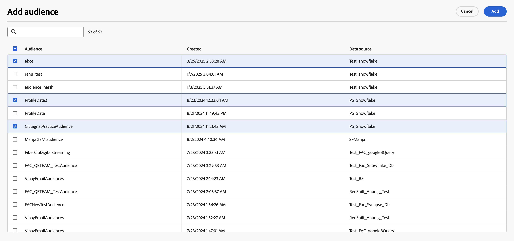

# 开始使用数据模型 {#data-model-beta}

>[!AVAILABILITY]
>
>要访问数据模型，您需要以下权限之一：
>
>-**管理联合数据模型**
>&#x200B;>-**查看联合数据模型**
>
>有关所需权限的详细信息，请参阅[访问控制指南](/help/governance-privacy-security/access-control.md)。

## 什么是数据模型 {#data-model-start}

数据模型是一组架构、受众以及它们之间的链接。 它用于将受众与数据库数据联合起来。

在联合受众构成中，您可以直接在画布视图中创建和管理数据模型。 这包括添加架构和受众，以及根据用例定义它们之间的链接。

了解有关[架构](../customer/schemas.md#schema-start)和[受众](../start/audiences.md)的更多信息。

例如，您可以在下文中看到数据模型的表示形式：具有其名称的表以及它们之间的链接。

{zoomable="yes"}

## 创建数据模型 {#data-model-create}

要创建数据模型，请执行以下步骤：

1. 在&#x200B;**[!UICONTROL 联合数据]**&#x200B;部分中，访问&#x200B;**[!UICONTROL 模型]**&#x200B;菜单，并浏览到&#x200B;**[!UICONTROL 数据模型]**&#x200B;选项卡。

   单击&#x200B;**[!UICONTROL 创建数据模型]**&#x200B;按钮。

   {zoomable="yes"}

1. 定义数据模型的名称，然后单击&#x200B;**[!UICONTROL 创建]**&#x200B;按钮。

1. 在数据模型仪表板中，单击&#x200B;**[!UICONTROL 添加架构]**&#x200B;以选择与数据模型关联的架构。

   {zoomable="yes"}

1. 此外，您还可以将受众添加到数据模型。 选择&#x200B;**[!UICONTROL 添加受众]**&#x200B;以定义目标组。

   {zoomable="yes"}

1. 在数据模型中的表之间建立连接，以确保准确的数据关系。 [了解详情](#data-model-links)

1. 完成配置后，单击&#x200B;**[!UICONTROL 保存]**&#x200B;以应用更改。

## 创建链接 {#data-model-links}

>[!BEGINTABS]

>[!TAB 表视图]

要从“表”视图选项卡创建数据模型的表之间的链接，请执行以下步骤：

1. 单击其中一个表的&#x200B;**[!UICONTROL 创建链接]**&#x200B;菜单，或单击&#x200B;**[!UICONTROL 创建链接]**&#x200B;按钮，然后选择2个表：

   {zoomable="yes"}

1. 填写给定的表单以定义链接。

   {zoomable="yes"}

   **基数**

   * **1-N**：源表格的一个存在可以拥有目标表格的多个对应存在，但目标表格的一个存在最多可以拥有源表格的一个对应存在。

   * **N-1**：目标表的一个存在可以具有源表的多个对应存在，但源表的一个存在最多可以具有目标表的一个对应存在。

   * **1-1**：源表格的一个存在最多可以具有目标表格的一个对应存在。

为数据模型定义的所有链接如下所示：

{zoomable="yes"}

>[!TAB 画布视图]

要从“画布视图”选项卡创建数据模型表之间的链接，请执行以下步骤：

1. 访问数据模型的“画布”视图，然后选择要链接的两个表

1. 单击Source联接旁边的按钮，然后拖动箭头并引导至Target联接以建立连接。

   {zoomable="yes"}

1. 填写给定表单以定义链接，配置完毕后单击&#x200B;**[!UICONTROL 应用]**。

   {zoomable="yes"}

   **基数**

   * **1-N**：源表格的一个存在可以拥有目标表格的多个对应存在，但目标表格的一个存在最多可以拥有源表格的一个对应存在。

   * **N-1**：目标表的一个存在可以具有源表的多个对应存在，但源表的一个存在最多可以具有目标表的一个对应存在。

   * **1-1**：源表格的一个存在最多可以具有目标表格的一个对应存在。

1. 数据模型中定义的所有链接在画布视图中均表示为箭头。 单击两个表之间的箭头可查看详细信息、进行编辑或根据需要删除链接。

   {zoomable="yes"}

1. 使用工具栏自定义和调整画布。

   

   * **[!UICONTROL 放大]**：放大画布以更清楚地查看数据模型的详细信息。
   * **[!UICONTROL 缩小]**：缩小画布大小，以便更全面地查看数据模型。
   * **[!UICONTROL 适合视图]**：调整缩放以适合可见区域中的所有架构和/或受众。
   * **[!UICONTROL 切换交互]**：启用或禁用用户与画布的交互。
   * **[!UICONTROL 筛选器]**：选择要在画布中显示的架构。
   * **[!UICONTROL 强制自动布局]**：自动排列架构和/或受众以更好地进行组织。

>[!ENDTABS]

## 操作方法视频 {#data-model-video}

请在此视频中了解如何创建数据模型：

>[!VIDEO](https://video.tv.adobe.com/v/3432020)
