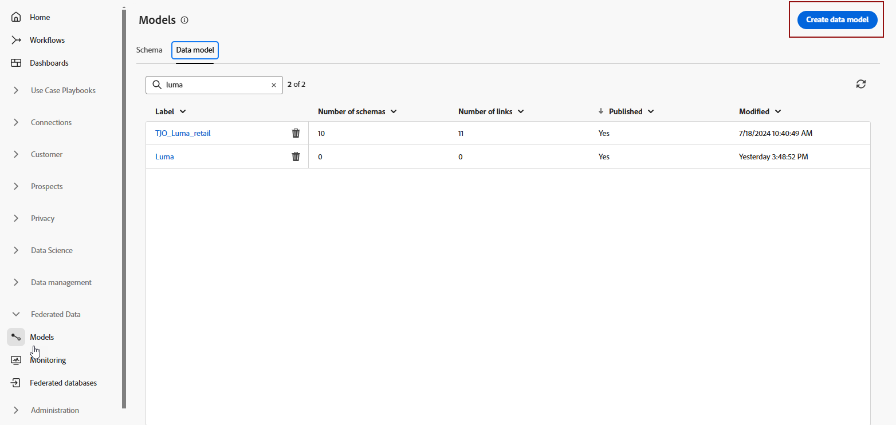

# 开始使用数据模型 {#data-model}

>[!CONTEXTUALHELP]
>id="dc_model_menu"
>title="使用模型"
>abstract="此屏幕列出了架构和数据模型。您可以通过 **创建** 按钮创建架构和数据模型。"

>[!CONTEXTUALHELP]
>id="dc_datamodel_add_schema"
>title="选择架构"
>abstract="选择数据模型的架构。"

>[!CONTEXTUALHELP]
>id="dc_datamodel_add_audience"
>title="选择受众"
>abstract="选择数据模型的受众。"

>[!CONTEXTUALHELP]
>id="dc_datamodel_properties"
>title="数据模型属性"
>abstract="输入数据模型的标签。"

## 什么是数据模型 {#data-model-start}

数据模型是一组架构、受众以及它们之间的链接。 它用于将受众与数据库数据联合起来。

了解有关[架构](../customer/schemas.md#schema-start)的更多信息。

了解有关[受众](../start/audiences.md)的更多信息。

例如，您可以在下方看到数据模型的表示形式：表及其名称和它们之间的链接。

{zoomable="yes"}

在联合受众组合中，可以创建许多数据模型。

将根据用例创建这些表：您选择必要的表，并根据需要链接这些表。

## 创建数据模型 {#data-model-create}

要创建数据模型，请执行以下步骤：

1. 在&#x200B;**[!UICONTROL 联合数据]**&#x200B;部分中，进入&#x200B;**[!UICONTROL 模型]**&#x200B;链接，并浏览到&#x200B;**[!UICONTROL 数据模型]**&#x200B;选项卡。

   {zoomable="yes"}

1. 单击&#x200B;**[!UICONTROL 创建数据模型]**&#x200B;按钮以定义数据模型的名称，然后单击&#x200B;**[!UICONTROL 创建]**&#x200B;按钮。

   {zoomable="yes"}

1. 然后，添加架构、受众和数据模型的链接。

   {zoomable="yes"}

### 创建链接 {#data-model-links}

要在数据模型的表之间创建链接，请执行以下步骤：

1. 单击其中一个表的&#x200B;**[!UICONTROL 创建链接]**&#x200B;菜单，或单击&#x200B;**[!UICONTROL 创建链接]**&#x200B;按钮，然后选择2个表：

   {zoomable="yes"}

1. 填写给定的表单以定义链接。

   {zoomable="yes"}

   **基数**

   * 1-N：源表格的一个存在可以具有目标表格的多个对应存在，但目标表格的一个存在最多可以具有源表格的一个对应存在。

   * N-1：目标表格的一个存在可以具有源表格的多个对应存在，但源表格的一个存在最多可以具有目标表格的一个对应存在。

   * 1-1：源表格的一个存在最多可以具有目标表格的一个对应存在。

为数据模型定义的所有链接如下所示：

{zoomable="yes"}

## 操作方法视频 {#data-model-video}

请在此视频中了解如何创建数据模型：

>[!VIDEO](https://video.tv.adobe.com/v/3432020)
