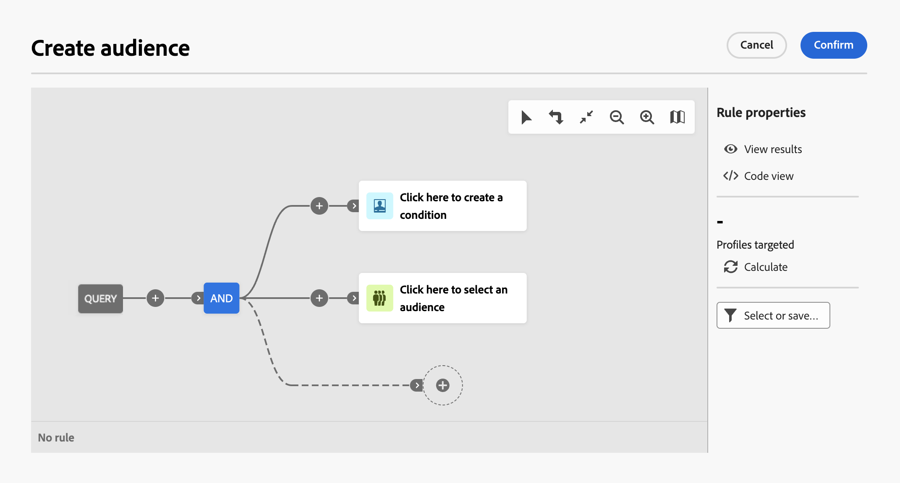

# 使用查询建模器 {#segment-builder}

>[!CONTEXTUALHELP]
>id="dc_orchestration_querymodeler_querymessage"
>title="查询建模器"
>abstract="为数据库中的收件人或任何其他架构（也称为目标维度）定义筛选条件。"

查询建模器简化了基于各种条件筛选数据库的过程。 此外，查询建模器可以有效地管理非常复杂和较长的查询，从而提供增强的灵活性和精度。 此外，它还支持条件中的预定义过滤器，使您能够轻松优化查询，同时利用高级表达式和运算符进行全面的受众定位和细分策略。

## 访问查询建模器

在每个需要定义规则以过滤数据的环境下都有查询建模器可用。

| 使用情况 | 示例 |
|  ---  |  ---  |
| **定义受众**：指定要在合成中定位的受众，并轻松创建适合您需求的新受众。 | {zoomable="yes"}{width="200" align="center" zoomable="yes"} |
| **自定义工作流活动**：在合成活动中应用规则，例如 **拆分** 和 **协调**，以符合您的特定要求。 [了解有关作曲活动的更多信息](../compositions/activities/about-activities.md) | {zoomable="yes"}{width="200" align="center" zoomable="yes"} |

## 查询建模器界面 {#interface}

查询建模器提供一个中央画布，您可以在其中生成查询，以及一个右侧窗格，提供有关查询的信息。

{zoomable="yes"}

### 中央画布 {#canvas}

查询建模器中央画布是添加和组合构建查询的不同组件的地方。 [了解如何构建查询](build-query.md)

位于画布右上角的工具栏提供了一些选项，可让您轻松操作查询组件并在画布中导航：

* **多选模式**：选择多个筛选组件以将其复制并粘贴到您选择的位置。
* **旋转**：垂直切换画布。
* **适合屏幕**：使画布缩放级别适应您的屏幕。
* **缩小** / **放大**：缩小或缩小画布。
* **显示地图**：打开画布的快照，显示您的位置。

### “规则属性”窗格 {#rule-properties}

在右侧，“ **[!UICONTROL 规则属性]** ”窗格提供有关查询的信息。 它允许您执行各种操作来检查查询并确保它满足您的需求。 [了解如何检查和验证查询](build-query.md#check-and-validate-your-query)
