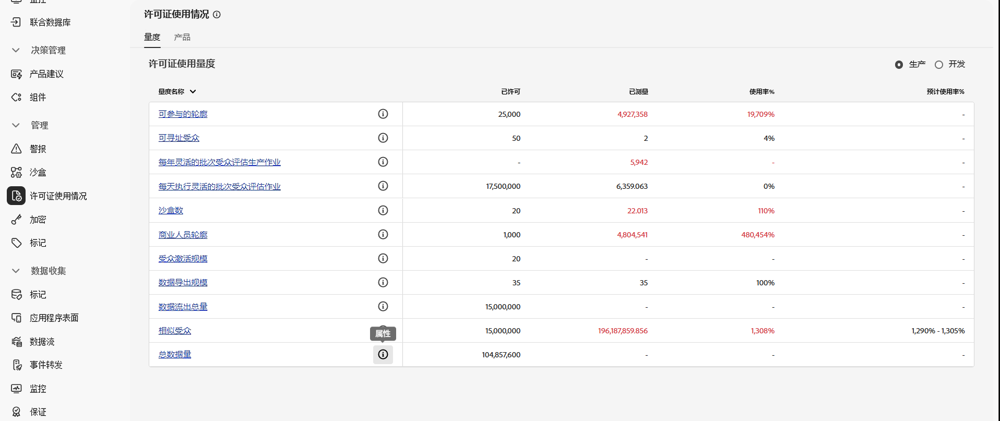
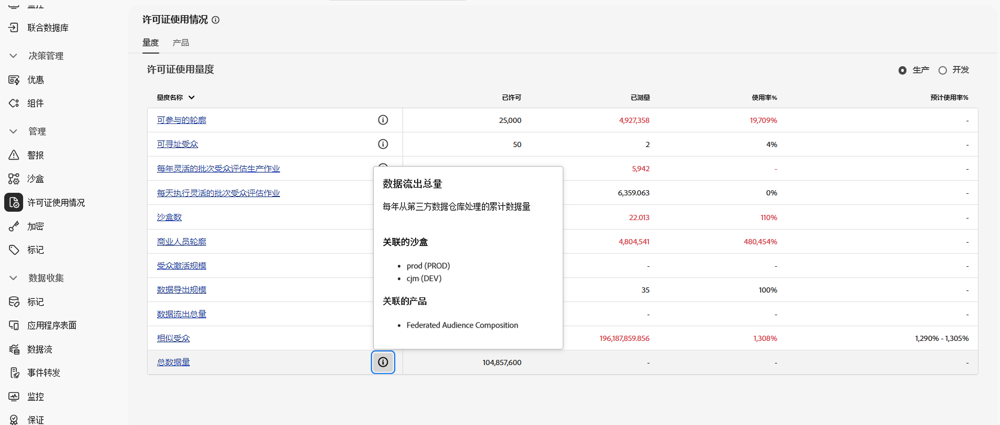

# 先决条件和护栏 {#fac-access}

联合受众构成需要 Adobe Real-Time Customer Data Platform 和/或 Adobe Journey Optimizer **Prime** 或 **Ultimate** 包。要访问此功能，您必须要购买联合受众构成插件。

>[!AVAILABILITY]
>
>在您收到 Adobe 发来的欢迎邮件通知后，界面可能需要几个小时才能更新，功能才会对您可用。

## 支持的系统 {#supported-systems}

联合受众构成支持以下云仓库：

* Amazon Redshift
* Azure Synapse
* 数据块
* Google BigQuery
* Snowflake
* Vertica Analytics
* Microsoft Fabric

在[此页面](../connections/connections.md)中了解如何与这些系统建立连接。

## 沙盒

购买联合受众构成时，您有权使用两个沙盒。对于任何其他沙盒设置请求，请联系您的 Adobe 代表。

要查看活跃的联合受众构成沙盒列表，请按照以下步骤操作：

1. 从联合受众构成中，访问&#x200B;**[!UICONTROL 管理]**&#x200B;下的&#x200B;**[!UICONTROL 许可证使用情况]**&#x200B;菜单。

1. 点击&#x200B;**[!UICONTROL 总数据流出量]**&#x200B;中的  图标，以访问您的沙盒属性。

   

1. 有关您的沙盒的信息会在“属性”弹出窗口中显示。

   

## 权限 {#permissions}

要访问联合受众构成，必须将用户添加到购买时创建的特定沙盒的产品轮廓中，并为其分配&#x200B;**[!UICONTROL 管理联合数据]**&#x200B;的权限。[了解详情](/help/governance-privacy-security/access-control.md)

## IP 允许列表 {#ip}

要安全地启用联合受众构成来访问您的数据库，您必须授权将会访问这些数据库的联合受众构成服务器的 IP 地址。在 Adobe Experience Platform 用户界面中添加联合数据库时会显示这些 IP 地址。[了解详情](../connections/connections.md)

将这些 IP 地址添加到您的允许列表中，以授予联合受众构成访问权限。

## 合并策略 {#merge-policies}

要使用联合受众组合生成受众，您&#x200B;**必须**&#x200B;使用顺序为&#x200B;**的合并策略的**&#x200B;时间戳。 如果您的受众使用&#x200B;**数据集优先级**&#x200B;合并策略，请联系Adobe客户关怀部门以继续。

有关合并策略的更多信息，请阅读[合并策略概述](https://experienceleague.adobe.com/zh-hans/docs/experience-platform/profile/merge-policies/overview)。

## 护栏和限制 {#fac-guardrails}

* [Adobe Real-Time Customer Data Platform 文档](https://experienceleague.adobe.com/zh-hans/docs/experience-platform/profile/guardrails){target="_blank"}中列出的相关权限、产品限制和性能护栏适用于联合受众构成。

* 联合受众构成支持导出大型受众，文件大小可超过 1GB。为了获得最佳性能，建议的最大文件大小为 20 GB。
