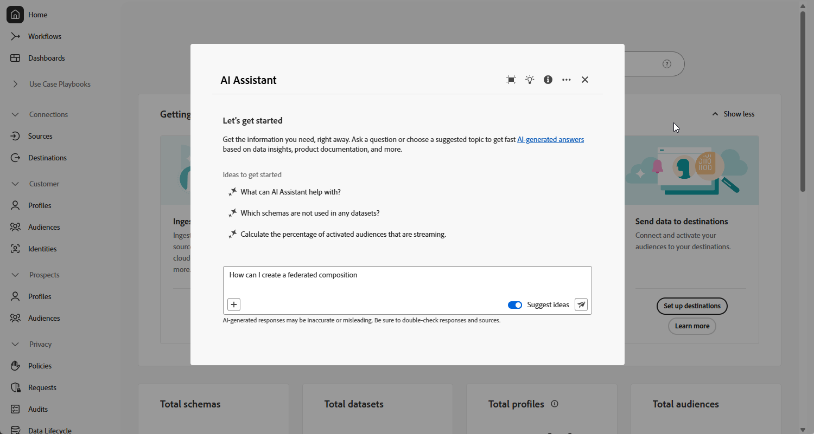

# 使用 AI 助手 {#ai-assistant}

AI Assistant是一项用户界面功能，旨在帮助您导航和了解Adobe概念，并获得您特定环境的操作见解。 它在Adobe Experience Cloud的多个产品中可用，包括联合受众合成。

要访问AI助手，请单击顶栏上的图标。 AI助手将显示在屏幕的右侧部分。

>[!CAUTION]
>
>在使用AI助手之前，您必须同意Adobe Experience Cloud创作AI用户准则。 在[此页面](https://experienceleague.adobe.com/en/docs/experience-platform/ai-assistant/home){target="_blank"}中了解有关协议的更多信息。

在Federated Audience Composition中，您可以访问与流程各个方面相关的Adobe概念相关的产品知识问题。 此类问题的示例包括：

* 在Snowflake和Adobe Experience Platform之间建立联合连接所需的配置设置是什么？
* 如何在联合受众组合中设置组合？
* 如何在查询Modeler中使用预定义过滤器来优化我的受众选择？

要提出问题，请执行以下操作：

1. 在屏幕底部的字段中输入该值，然后按Enter键。

   

1. 检查答案并使用&#x200B;**显示源**&#x200B;按钮获取产品文档的直接链接并了解更多信息。

   

1. 使用拇指向上或向下对答案进行评分。

要了解如何使用AI助手，请查看可以使用AI助手实现的示例目标，并了解AI助手的工作原理，请参阅[Adobe Experience Platform文档](https://experienceleague.adobe.com/en/docs/experience-platform/ai-assistant/home){target="_blank"}。
