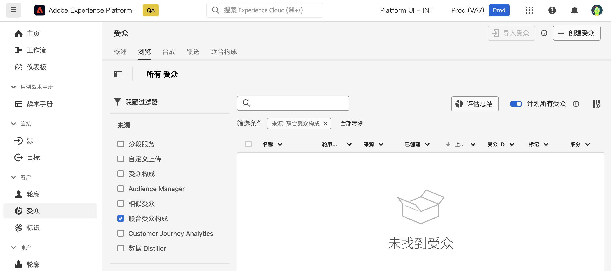

# 使用受众 {#gs-audiences}

使用 Experience Platform 联合受众构成允许您[创建构成](../compositions/gs-compositions.md)，并且可以将各种活动应用到一个可视化画布中来创建受众，并将其存储到 Adobe Experience Platform 受众门户中。

然后，您可以在 Journey Optimizer 中定位这些受众，或将他们激活到 Adobe Experience Platform 支持的任何目的地。

## 使用构成创建受众{#creation}

要使用联合受众构成创建受众，您需要创建一个包含&#x200B;**[!UICONTROL 保存受众]**&#x200B;活动的构成。通过此活动，您可以将受众保存到受众门户，并从外部数据库中选择要包含在受众中的字段。[了解如何配置“保存”受众活动](../compositions/activities/save-audience.md)。

使用 Adobe 联合受众构成创建的受众包括在&#x200B;**[!UICONTROL 保存受众]**&#x200B;活动中选择的所有字段，并与所有 Adobe Experience Platform 受众一起存储在受众门户中。

执行构成后，生成的受众将会作为外部受众保存在 Adobe Experience Platform 中，并可进入 Adobe Real-Time Customer Data Platorm 和/或 Adobe Journey Optimizer。

您可以将这些受众激活到 Adobe Experience Platform 支持的任何目标。了解如何在  [Adobe Experience Platform](https://experienceleague.adobe.com/zh-hans/docs/experience-platform/destinations/home){target="_blank"} 中使用目标

>[!NOTE]
>
>使用 Adobe 联合受众构成创建的受众无法编辑。要对这些受众之一进行修改，您需要使用构成创建一个新受众。

## 访问 Adobe Experience Platform 中的受众 {#access-audience}

使用联合受众构成创建的受众可在受众门户中访问，而该门户可从&#x200B;**受众**&#x200B;菜单访问。

**[!UICONTROL 浏览]**&#x200B;选项卡列出了存储到 Adobe Experience Platform 中的所有现有受众。您可以使用&#x200B;**[!UICONTROL 来源]**&#x200B;列或左侧窗格中的过滤器来识别列表中的联合受众构成受众。

有关如何在 Adobe Experience Platform 中与受众合作的更多信息，请参阅[受众门户文档](https://experienceleague.adobe.com/zh-hans/docs/experience-platform/segmentation/ui/audience-portal){target="_blank"}

<!-- add link to this donc once published: https://jira.corp.adobe.com/browse/PLAT-198674-->