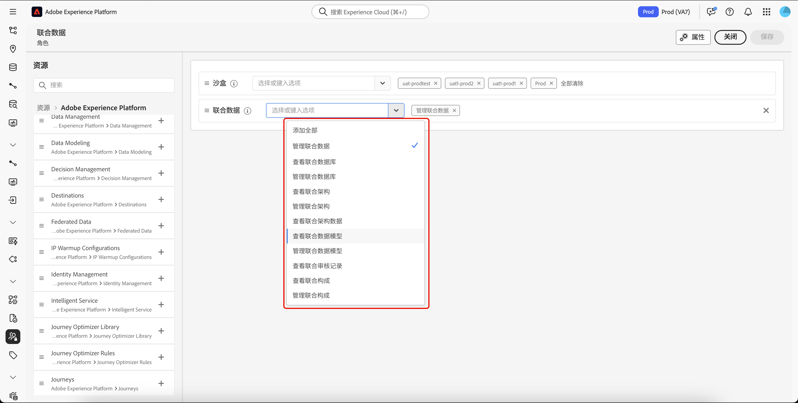

# 访问联合受众构成 {#feature-access}

## 管理对沙盒的访问 {#access-sandboxes}

当您购买联合 Adobe Experience Platform 联合受众构成时，系统会为每个活跃沙盒创建一个产品轮廓。此产品轮廓是在 Admin Console 中的 **Adobe Experience Platform** 产品卡下创建的，并遵循以下命名惯例：`ACP_FAC - <<SandboxName>> - admin.`要访问特定沙盒的联合受众构成，必须将用户添加到为该沙盒创建的产品轮廓中。

例如，如果激活了一个名为“fac-test”的新沙盒，则会创建相应的产品轮廓“ACP_FAC - fac-test - admin”。为了使用此沙盒访问联合受众构成，需要将用户添加到此产品轮廓中。

## 管理对联合受众构成的访问权限

要访问&#x200B;**联合受众构成**，您必须首先确保分配所需的权限来访问联合受众构成的不同方面。然后必须将这些角色分配给需要访问&#x200B;**联合受众构成**&#x200B;的用户。

请注意，只有管理员才有分配权限的权力。

1. 导航到&#x200B;**[!UICONTROL 权限]**&#x200B;菜单。

1. 从&#x200B;**[!UICONTROL 角色]**&#x200B;菜单中，选择您想要更新的&#x200B;**[!UICONTROL 角色]**。

   

1. 选择&#x200B;**[!UICONTROL 编辑]**&#x200B;以修改您的角色权限。

   

1. 为用户添加所需的权限。您可以添加以下权限来访问联合受众构成：

   | 权限 | 描述 |
   | ---------- | ----------- |
   | 管理联合数据 | 使用此权限来管理联合受众构成的所有方面。此权限包含管理联合数据库、管理联合架构、管理联合数据模型和管理联合构成。 |
   | 管理联合数据库 | 使用此权限来添加、查看、更新和删除与联合数据库的连接。 |
   | 查看联合数据库 | 使用此权限来查看您与联合数据库的连接。 |
   | 管理联合架构 | 使用此权限来创建、查看、更新、删除和刷新架构。 |
   | 查看联合架构数据 | 使用此权限来查看架构部分内的数据选项卡。 |
   | 查看联合架构 | 使用此权限来查看架构表。 |
   | 管理联合数据模型 | 使用此权限来创建、查看、更新和删除数据模型。 |
   | 查看联合数据模型 | 使用此权限来查看数据模型。 |
   | 查看联合审核记录 | 使用此权限来查看联合受众构成的审核记录。 |
   | 管理联合构成 | 使用此权限来创建、查看、更新和删除联合构成。 |
   | 查看联合构成 | 使用此权限来查看联合构成。 |

   

1. 完成必要的更改后，请选择&#x200B;**[!UICONTROL 保存]**。

任何已分配此角色的用户的权限都将自动更新，并可访问联合受众构成。

要将此角色分配给新用户：

1. 导航到角色仪表板中的&#x200B;**[!UICONTROL 用户]**&#x200B;选项卡，然后选择&#x200B;**[!UICONTROL 添加用户]**。

   

1. 输入用户的姓名或电子邮件地址，或从可用列表中选择。完成后选择&#x200B;**[!UICONTROL 保存]**。

<!-- Alternatively, you can assign one of the pre-existing roles to the users, depending on what permissions they need. For more information on assigning pre-existing roles to a user, please read the [guide on managing users for a product profile](https://experienceleague.adobe.com/zh-hans/docs/experience-platform/access-control/ui/users).

| Role name | Permissions |
| --------- | ----------- |
| FAC Data Managers | <ul><li>Manage Federated Compositions</li><li>View Federated Databases</li><li>View Federated Schemas</li><li>View Federated Schema Data</li><li>View Federated Data Models</li></ul> |
| FAC Composition Managers | <ul><li>Manage Federated Compositions</li></ul> |
| FAC Administrators | <ul><li>Manage Federated Data</li></ul> | -->

然后，用户会收到一封电子邮件，其中包含访问实例的说明。如果之前没有创建用户，请参阅[此文档](https://experienceleague.adobe.com/zh-hans/docs/experience-platform/access-control/abac/permissions-ui/users)。
