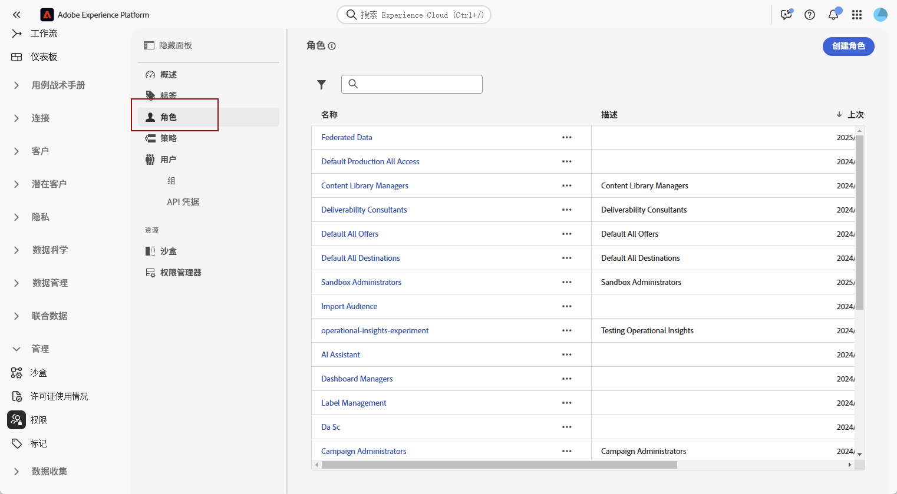
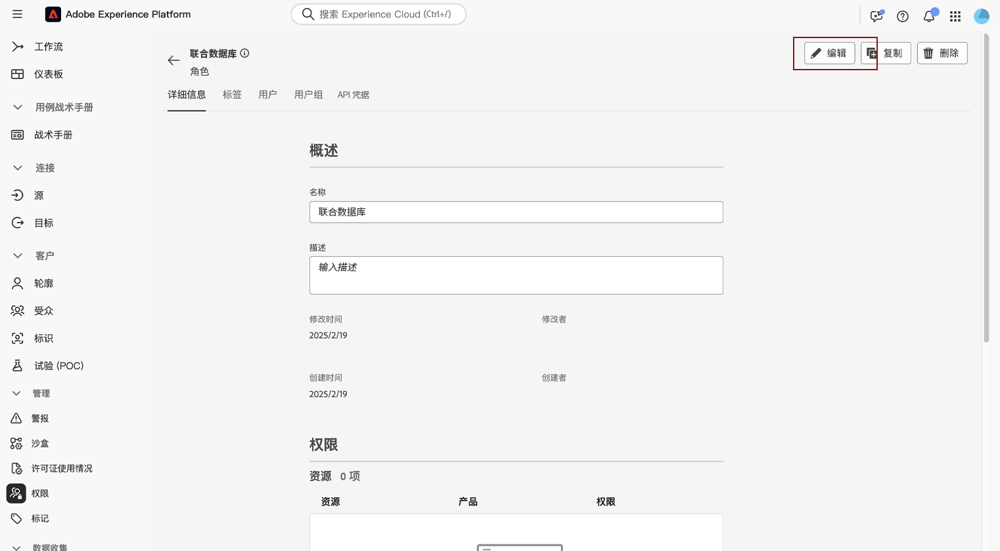
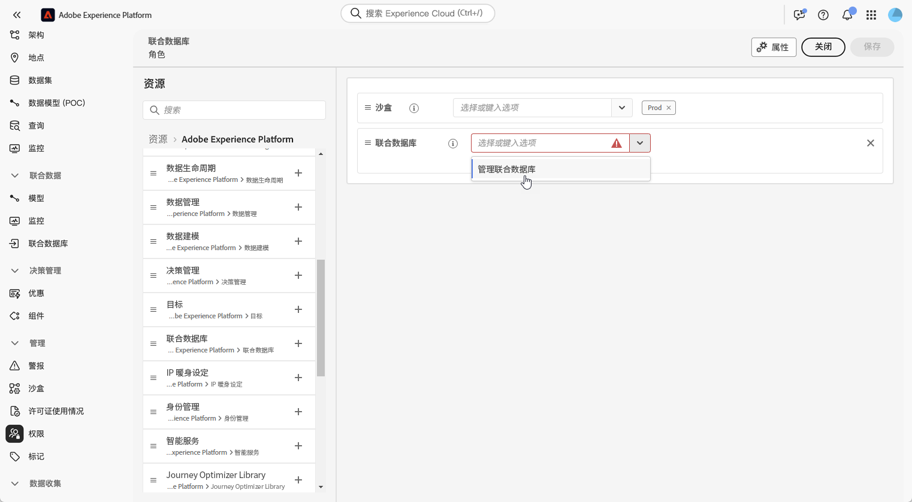
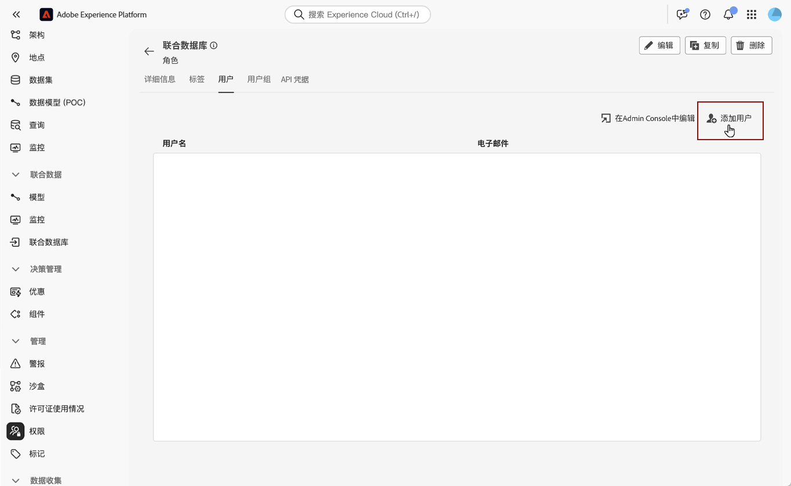

# 访问联合受众组合 {#feature-access}

## 管理对沙盒的访问 {#access-sandboxes}

当您购买联合受众构成插件时，系统会为每个活动沙盒创建一个产品轮廓。此产品轮廓是在 Admin Console 中的 **Adobe Experience Platform** 产品卡下创建的，并遵循以下命名惯例：`ACP_FAC - <<SandboxName>> - admin.`要访问特定沙盒的联合受众构成，必须将用户添加到为该沙盒创建的产品轮廓中。

例如，如果激活了一个名为“fac-test”的新沙盒，则会创建相应的产品轮廓“ACP_FAC - fac-test - admin”。为了使用此沙盒访问联合受众构成，需要将用户添加到此产品轮廓中。

## 管理对联合受众组合的访问

>[!AVAILABILITY]
>
>权限作为3月版本的一部分提供。

要访问&#x200B;**联合受众合成**，您必须首先确保将&#x200B;**管理联合数据**&#x200B;权限分配给相应的角色。 然后，必须将这些角色分配给需要访问&#x200B;**联合受众合成**&#x200B;的用户。

请注意，只有管理员能够分配权限。

1. 导航到&#x200B;**[!UICONTROL 权限]**&#x200B;菜单。

1. 从&#x200B;**[!UICONTROL 角色]**&#x200B;菜单中，选择要更新的&#x200B;**[!UICONTROL 角色]**。

   

1. 单击&#x200B;**[!UICONTROL 编辑]**&#x200B;以修改角色的权限。

   

1. 添加&#x200B;**联合数据**&#x200B;资源，然后从下拉菜单中选择&#x200B;**[!UICONTROL 管理联合数据]**。

   

1. 进行必要的更改后，单击&#x200B;**[!UICONTROL 保存]**。

已分配给此角色的任何用户都将自动更新其权限，并有权访问联合受众合成。

要将此角色分配给新用户，请执行以下操作：

1. 导航到角色仪表板中的&#x200B;**[!UICONTROL 用户]**&#x200B;选项卡，然后单击&#x200B;**[!UICONTROL 添加用户]**。

   

1. 输入用户的名称或电子邮件地址，或从可用列表中选择。 完成后，单击&#x200B;**[!UICONTROL 保存]**。

随后，用户将收到一封电子邮件，其中包含访问实例的说明。 如果之前没有创建用户，请参阅[此文档](https://experienceleague.adobe.com/zh-hans/docs/experience-platform/access-control/abac/permissions-ui/users)。
