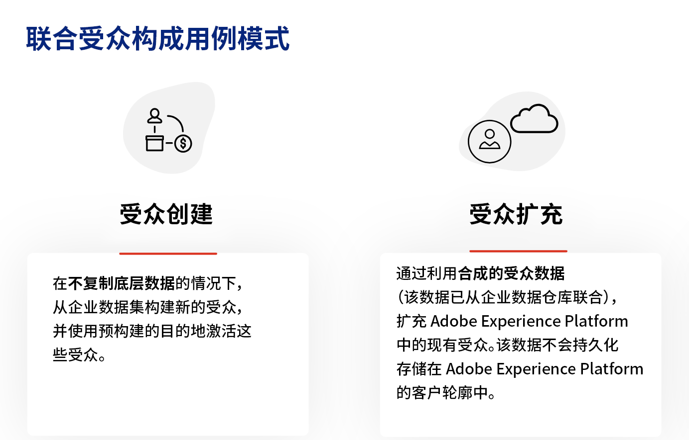
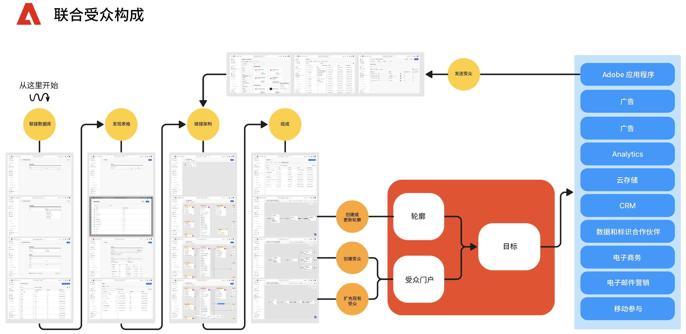

# 开始使用联合受众构成 {#gs-fac}

联合受众构成是 [Adobe Real-Time Customer Data Platform](https://experienceleague.adobe.com/zh-hans/docs/experience-platform/segmentation/home){target="_blank"} 和 [Adobe Journey Optimizer](https://experienceleague.adobe.com/zh-hans/docs/journey-optimizer/using/ajo-home){target="_blank"} 的附加组件功能，可让您从第三方数据仓库构建和扩充受众，并将受众导入 Adobe Experience Platform。联合受众构成提供了一种简单而强大的解决方案，可直接在 Adobe Real-Time Customer Data Platform 和/或 Adobe Journey Optimizer 内连接您的企业数据仓库，并对数据仓库的表格执行查询。

Adobe 联合受众构成可帮助 Adobe Experience Platform 应用程序用户访问存储在其数据仓库和云存储平台（例如 Amazon Redshift、Azure Synapse Analytics 等）中的客户数据。客户数据可存储在多个数据仓库中，并且现在可以立即访问，而无需复制。支持的平台列于[此页面](../connections/federated-db.md#supported-db)中。

## 功能 {#rn-capabilities}

联合受众构成通过全面的受众管理和激活方法扩展了 Real-Time CDP 和 Journey Optimizer 的价值：

* 通过扩大对关键仓库数据集的访问权限来创建高价值受众：利用现有数据仓库作为主要的记录系统，同时利用一流的应用程序来提供出色的客户体验。

* 全面支持参与用例：联合受众构成与 Real-Time CDP 或 Journey Optimizer 相结合，支持由品牌发起的联合受众个性化体验，并提供由实时事件触发的即时体验，同时结合人员属性来满足跨团队的用例要求。

* 最小化数据移动和重复：从企业数据仓库中的数据集创建受众，而无需复制基础数据来管理可操作的营销配置文件和受众。

* 利用一个系统来实现由体验驱动的工作流程：在 Adobe Experience Platform 中策划摄取和联合的受众，并协调所有渠道的出站体验。

## 用例 {#rn-uc}

通过易于营销的 UI，创建细分规则，查询数据仓库以获取符合营销活动所需的特定区段的用户列表，访问仓库中的现有受众以进行激活，或使用仓库中存在的其他数据点扩充 Adobe Experience Platform 受众。

在此版本中，有两种用例可用：

1. 受众创建：无需复制基础数据，即可从企业数据集构建新的受众，并使用预先构建的目标激活这些受众。&#x200B;

1. 受众扩充：利用从企业数据仓库联合而来的受众数据来扩充 Adobe Experience Platform 中的现有受众。该数据不会保留在 Adobe Experience Platform 客户配置文件中。

{zoomable="yes"}{width="75%" align="center"}

## 关键步骤 {#gs-steps}

使用 Adobe 联合受众构成可以直接从数据库创建和更新 Adobe Experience Platform 受众，而无需任何引入过程。

<!--{zoomable="yes"}{width="85%" align="center"}-->

关键步骤：

1. **数据集成**：汇集来自不同来源的数据，并将其合并为统一的数据集。若要了解如何连接 Adobe Experience Platform 应用程序以及您的企业数据仓库、所支持的数据库以及如何配置它们，请参阅[本节](../connections/federated-db.md)中的详细说明。

1. **数据建模**：设计和创建定义数据结构、关系和约束的数据模型和模式。要了解有关架构的更多信息，请参阅[本页](../customer/schemas.md)。在[此页面](../data-management/gs-models.md)中了解如何为您的数据模型创建链接。

1. **数据转换**：应用数据操作技术来修改数据元素的格式、结构或值，使其兼容或适合特定的分析或应用程序。

1. **数据使用**：创建、组织和建立受众。在[此页面](../compositions/gs-compositions.md)中了解如何组合观众。您还可以通过 Adobe Experience Platform 受众门户和目标更新或重复使用现有受众。在[此页面](../connections/destinations.md)中了解详情

>[!NOTE]
>
>执行构成后，生成的受众将会作为外部受众保存在 Adobe Experience Platform 中，并可进入 Adobe Real-Time Customer Data Platorm 和/或 Adobe Journey Optimizer。它可在&#x200B;**受众**&#x200B;菜单中访问。[了解详情](https://experienceleague.adobe.com/zh-hans/docs/experience-platform/segmentation/ui/audience-portal){target="_blank"}

## 了解详情 {#learn}

<!-- Workflow + Workflow activities-->

在[该页面](access-prerequisites.md)中了解如何访问联合受众构成、护栏和限制。

也可以在[此页面](faq.md)中查阅常见问题解答。

>[!CONTEXTUALHELP]
>id="dc_workflow_settings_execution"
>title="执行设置"
>abstract="在此部分中，您可以配置与工作流执行相关的设置，例如构成历史记录的保留天数。"

>[!CONTEXTUALHELP]
>id="dc_orchestration_query_enrichment_noneditable"
>title="无法编辑活动"
>abstract="在控制台中为某个&#x200B;**查询**&#x200B;或&#x200B;**扩充**&#x200B;活动配置了其他数据后，扩充数据被考虑并传递到出站转换，但无法编辑该活动。"

<!-- Create a link -->

>[!CONTEXTUALHELP]
>id="dc_federated_database_create_link"
>title="创建链接"
>abstract="定义链接设置"

<!-- incremental query IDs -->

>[!CONTEXTUALHELP]
>id="dc_orchestration_incrementalquery"
>title="增量查询"
>abstract="**增量查询** 活动允许您使用查询建模器查询数据库。每次执行此活动时，都会排除先前执行得出的结果。这样可让您仅定向新元素。"

>[!CONTEXTUALHELP]
>id="dc_orchestration_incrementalquery_history"
>title="增量查询历史记录"
>abstract="增量查询历史记录"

>[!CONTEXTUALHELP]
>id="dc_orchestration_incrementalquery_processeddata"
>title="增量查询处理后的数据"
>abstract="增量查询处理后的数据"

>[!CONTEXTUALHELP]
>id="dc_orchestration_incrementalmode_standard"
>title="增量查询模式"
>abstract="增量查询允许您通过每次新执行排除以前执行的结果来多次执行相同的查询。"

>[!CONTEXTUALHELP]
>id="dc_orchestration_incrementalmode_custom"
>title="增量查询模式"
>abstract="增量查询允许您仅考虑日期字段晚于或等于增量查询活动的上次执行日期的结果，从而多次执行相同的查询。"

>[!CONTEXTUALHELP]
>id="dc_orchestration_build_audience_dimension"
>title="选择目标选择维度"
>abstract="通过目标选择维度，可定义操作面向的群体：收件人、合同受益人、操作人员、订阅者等。默认情况下，对于电子邮件和 SMS，目标是在收件人内置表中进行选择的。对于推送通知，默认目标维度是订阅者应用程序。"

<!-- save profile IDs-->

>[!CONTEXTUALHELP]
>id="dc_orchestration_saveprofile"
>title="保存轮廓"
>abstract="保存轮廓"

>[!CONTEXTUALHELP]
>id="dc_orchestration_saveprofile_selectaepschema"
>title="保存轮廓选择 AEP 模式"
>abstract="保存轮廓选择 AEP 模式"

>[!CONTEXTUALHELP]
>id="dc_orchestration_saveprofile_aepschemalist"
>title="保存轮廓 AEP 架构列表"
>abstract="保存轮廓 AEP 架构列表"

>[!CONTEXTUALHELP]
>id="dc_orchestration_saveprofile_selectaepattribute"
>title="保存轮廓 AEP 架构属性"
>abstract="保存轮廓 AEP 架构属性"

>[!CONTEXTUALHELP]
>id="dc_orchestration_saveprofile_selectprimaryfield"
>title="保存轮廓选择主要标识字段"
>abstract="保存轮廓选择主要标识字段"
