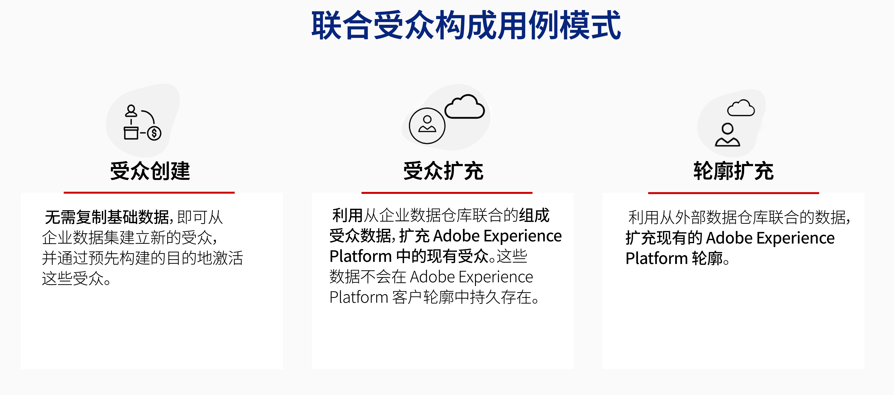

# 联合受众组合入门 {#gs-fac}

联合受众构成是一个Adobe Real-time Customer Data Platform和Adobe Journey Optimizer加载项，允许客户从第三方数据仓库构建和丰富受众，并将受众导入到Adobe Experience Platform。

Adobe Experience Platform Federated Audience Composition提供了一个简单而强大的解决方案，用于直接在Adobe Real-time Customer Data Platform和/或Adobe Journey Optimizer中连接企业数据仓库，并对Data Warehouse的表执行查询。

Adobe联合受众构成可帮助Adobe Experience Platform应用程序用户访问其客户数据，这些数据会存储到其数据仓库和云存储平台(如Amazon Redshift、Azure synapseAnalytics等)中。 客户数据可以存放在多个数据仓库中，现在无需复制即可即时访问。 [此页面](../connections/federated-db.md#supported-db)中列出了支持的平台。

## 用例 {#rn-uc}

通过营销友好UI，创建区段规则，这些规则可在数据仓库中查询符合营销活动所需特定区段资格的用户列表，访问仓库中的现有受众以供激活，或使用仓库中存在的附加数据点扩充Adobe Experience Platform受众。

在此版本中，提供了两个用例：受众分段和受众扩充。 用户档案扩充功能将在未来版本中提供。

{zoomable="yes"}

## 关键步骤 {#gs-steps}

通过Adobe联合受众合成，可直接从数据库创建和更新Adobe Experience Platform受众，而无需任何摄取过程。

{zoomable="yes"}

关键步骤：

1. **数据集成**：将来自各种源的数据合并到一个统一的数据集中。 [本节](../connections/federated-db.md)详细介绍了如何连接Adobe Experience Platform应用和您的企业数据仓库、支持的数据库以及如何配置它们。

2. **数据建模**：设计和创建定义数据结构、关系和约束的数据模型和架构。 在[此页面](../customer/schemas.md)中了解有关架构的更多信息。 在[此页面](../data-management/gs-models.md)中了解如何为数据模型创建链接。

3. **数据转换**：应用数据操作技术来修改数据元素的格式、结构或值，使其兼容或适用于特定的分析或应用程序。

4. **数据使用情况**：创建、编排和构建受众。 了解如何在[此页面](../compositions/gs-compositions.md)中组合受众。 您还可以通过Adobe Experience Platform受众门户和目标更新或重用现有受众。 在[此页面](../connections/destinations.md)中了解详情

## 常见问题 {#faq}

以下是有关联合受众组合的常见问题解答列表。 在[此页面](https://experienceleague.adobe.com/en/docs/experience-platform/segmentation/faq){target="_blank"}中，Adobe Experience Platform分段服务也提供了全局常见问题解答。

+++访问联合受众组合所需的权限是什么？

联合受众组合没有特定权限。 访问此功能的唯一先决条件就是已购买联合受众构成加载项。

+++

+++支持哪些云仓库？

对于此版本，联合受众组合与以下兼容：

* Amazon Redshift
* azure synapse
* Google Big Query
* Snowflake
* Vertica Analytics

+++

+++能否在同一构成中查询多个数据仓库？

可以，可以在同一组合中查询多个仓库，并且可以组合来自多个来源的数据。  通常，每个[组合活动](../compositions/orchestrate-activities.md)（查询、扩充、拆分等） 根据活动配置、目标数据库（可能存在多个联合数据访问情况）以及一个或多个工作表输出和执行结果执行一个或多个SQL语句。 这些工作表用作连续活动的输入。

+++

+++ 我是否可以使用联合受众组合访问整个数据库？

否，您可以配置对专用或共享数据库/模式的访问。 我们建议您为联合受众组合创建专用架构，并仅复制/共享业务案例数据集。
+++

+++我是否可以访问专用模式中的所有表？

是，连接后，可使用联合受众组合根据定义的初始权限发现所有表，然后可以使用可视模式编辑器执行以下操作：

* 从表中发现列和主键
* 为这些表创建友好标签
* 为每列创建易记标签
* 隐藏不必要的列
* 保存这些表说明
+++

+++联合受众构成中是否存在临时存储？

否，联合受众组合仅存储元数据（架构描述）。 没有客户数据正在中转。 直接从Adobe Experience Platform Audience Portal（通过[目标](../connections/destinations.md)）到客户数据库完成受众导出流程。 创建和更新流程可直接从Data Warehouse数据库发送到Adobe Experience Platform Audience Portal。

+++

+++联合受众构成是否存储要发送到下游系统的人员列表的物理副本？

联合受众构成不维护数据的物理副本。 在构成中配置频率，以定义此数据的刷新频率。 生成的受众数据不会由Adobe Experience Platform存储，客户用例或操作所要求的存储时间不会超过此存储时间。

例如：

* 在受众分段的情况下，受众是在您的仓库中创建的，在通过Adobe Experience Platform受众门户发布生成的受众和相关属性之前，您可以使用联合受众构成执行其他合成任务和数据操作。 受众定义和相关属性转到Adobe Experience Platform。
请注意，外部生成的受众的当前数据到期时间为30天。 此数据到期可减少组织中存储的多余数据量。 在数据过期后，关联的数据集仍会在数据集清单中可见，但您无法激活受众，并且配置文件计数将显示为零。 请参阅[Adobe Experience Platform文档](https://experienceleague.adobe.com/en/docs/experience-platform/segmentation/faq#how-long-do-externally-generated-audiences-last-for){target="_blank"}以了解详情。

* 对于受众扩充，起始点是现有的Adobe Experience Platform受众。 我们可以在这里看到两种情况：
   1. 从联合数据仓库引入其他受众有效负载属性：在这种情况下，添加的其他属性将作为此受众定义的一部分提供。 外部生成的受众的数据过期时间与上述相同，即30天。
   1. 根据数据仓库中存在的其他属性优化现有Adobe Experience Platform受众。 例如，您有一个受众客户，他们在过去两个月中对网站上的特定产品表现出兴趣。 现在，您需要接受此受众，并使用联合受众构成对其进行进一步分段，以仅包含具有高信用分数的客户。 信用评分被视为敏感，且不会从数据仓库复制单个信用评分数据点。
+++

+++如果未保留受众分段和受众扩充用例模式的数据，则它是如何临时存储的？

生成的受众数据不会在Adobe Experience Platform或联合受众构成中无限期保留。 它不会保留超过用例所需的时间。 作为受众有效负载的一部分引入的受众属性将仅作为受众定义的一部分保留。 持久性的持续时间基于任何受众的TTL，默认为30天。

+++

+++可以删除自定义上传的受众吗？

只需从操作菜单中选择删除，即可直接在Audience Portal中删除未在下游激活中使用的受众。 请参阅[Adobe Experience Platform文档](https://experienceleague.adobe.com/en/docs/experience-platform/segmentation/faq#how-do-i-put-an-audience-in-the-deleted-state){target="_blank"}以了解详情。

+++

+++如果合并来自多个源的数据，我们如何连接这些数据？ 我们是否使用Identity服务？

否，在组合期间未利用Identity Service。 组合中使用的各种源之间的数据通过用户定义的逻辑（如底层模型中表示的）进行连接，例如CRM ID、用户帐户号等。 您必须选择用作受众中标识符的标识，以供在数据仓库中选择。 对于联合受众组合产生的受众，您需要在产生的数据集中标识身份的身份命名空间。

+++

<!--
+++If I want to combine federated data with datasets that live in Adobe Experience Platform, how is this done?

Likewise, the Identity Service is not being leveraged in this scenario either. The data model underpinning a composition needs to express how the data warehouse data and the audience to be enriched are related. e.g. assume an existing audience in Adobe Experience Platform contains several attributes, among which is the CRM ID. Assume transactional data is in the data warehouse containing purchases with various attributes, including the CRM ID of the purchaser. The end-user would have to specify that the CRM ID for both objects is used to stitch the two objects together.

+++
-->

## 了解详情 {#learn}

<!-- Workflow + Workflow activities-->

>[!CONTEXTUALHELP]
>id="dc_workflow_settings_execution"
>title="执行设置"
>abstract="在此部分中，您可以配置与工作流执行相关的设置，如构成历史记录的保留天数。"

>[!CONTEXTUALHELP]
>id="dc_orchestration_query_enrichment_noneditable"
>title="无法编辑活动"
>abstract="在控制台中为某个&#x200B;**查询**&#x200B;或&#x200B;**扩充**&#x200B;活动配置了其他数据后，扩充数据被考虑并传递到出站转换，但无法编辑该活动。"

<!-- Create a link -->

>[!CONTEXTUALHELP]
>id="dc_federated_database_create_link"
>title="创建链接"
>abstract="定义链接设置"
